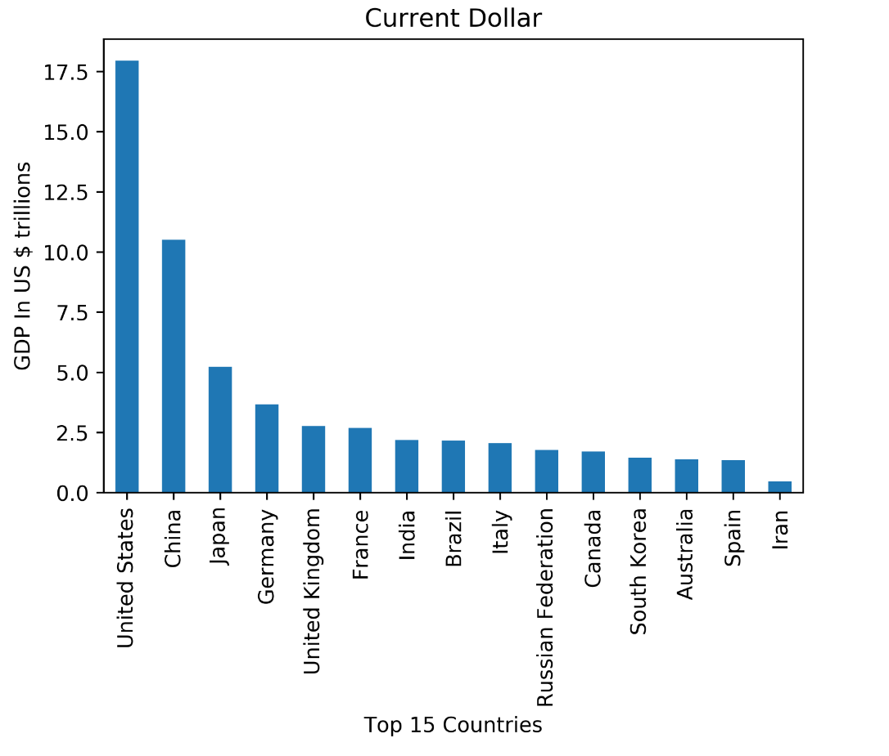
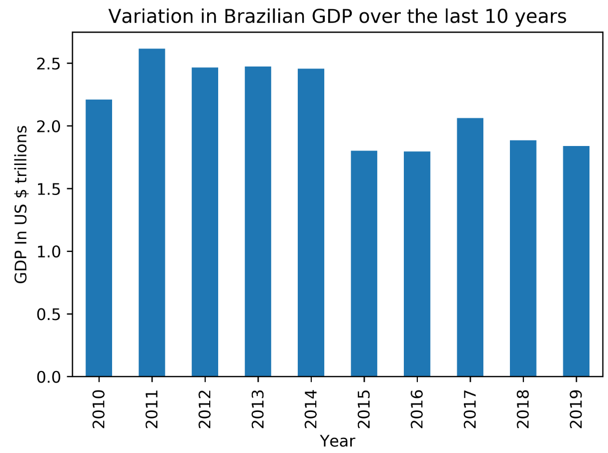
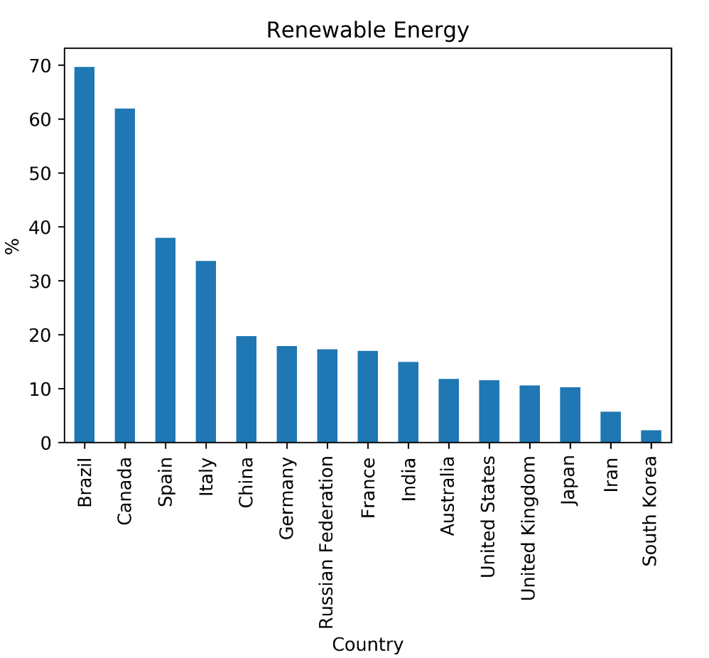
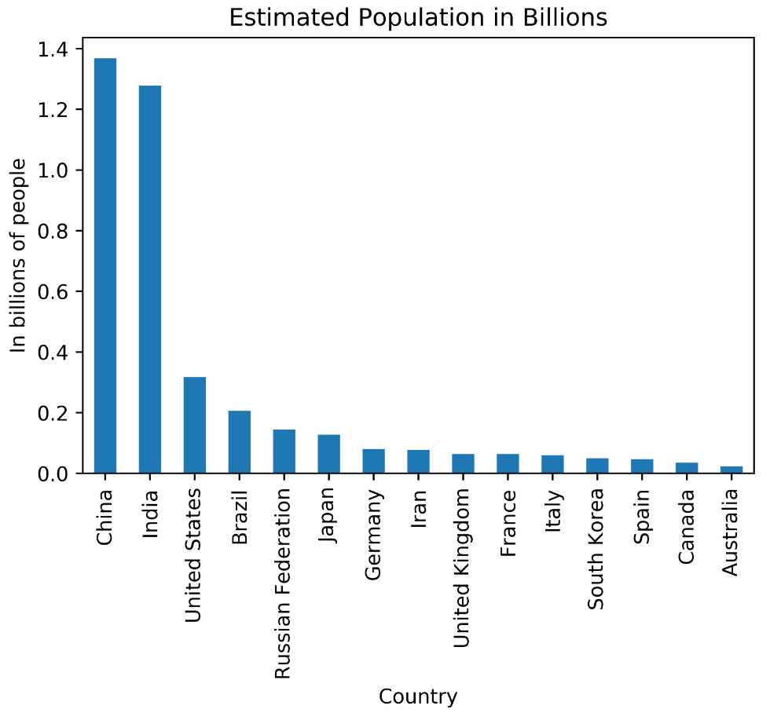
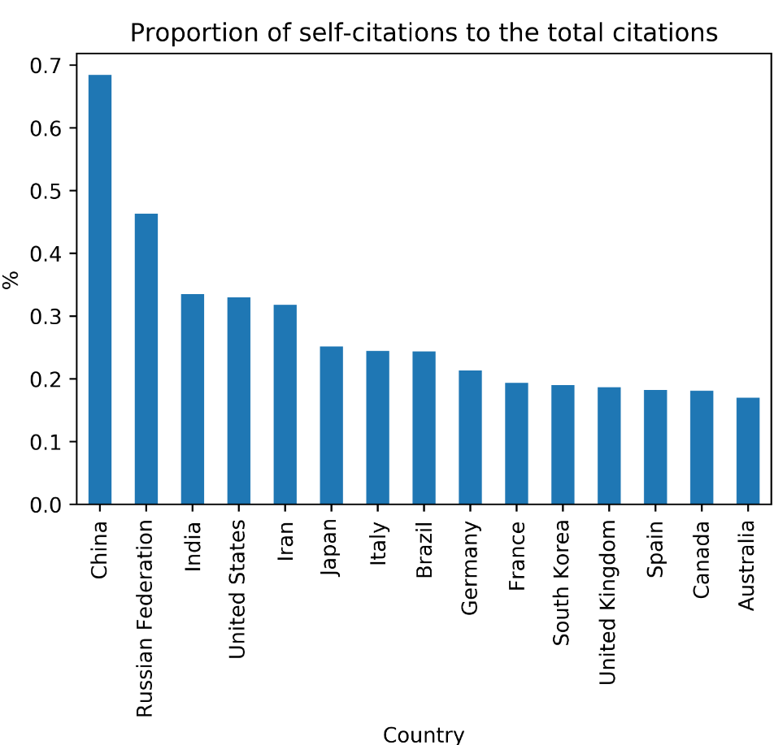

# GPD And Energy Supply

Code: [GitHub](https://github.com/WMaia9/PIB-e-Energy-Supply)

## Introduction

GDP is an acronym that means "Gross Domestic Product" and it is something extremely important for nations, because it consists of the sum of a country's monetary values.

In this way, this means that all goods and other types of services that are produced in a given region are added together over a period of time to know whether they are growing or not.

Thus, GDP is one of the most used indicators in the market economy, always aiming to carry out research on how all the economic activity of a country is doing.

Equally important, measuring sustainability indicators allows plants to assess the positive impacts of power generation, as well as the economic, social and environmental gains provided by the project.

Experts say combating climate change should be one of the pillars for post-pandemic economic recovery. This is due to the fact that sustainable investments can generate higher returns for the economy. In this sense, stimulating the generation of renewable energy in the plants is essential, both to reduce impacts on the environment and also for the plant to remain competitive even in challenging scenarios. And to assess this, it becomes even more important to monitor sustainability indicators on a daily basis.

Thinking about the great importance that energy indicators and their research impact on GDP and the great world movements that are happening in the search for clean and renewable energy, it seems interesting to make a case study on this content.

In this case study, some indicators of the last 10 years of the 15 largest economies in the world are analyzed. To do this, 3 datasets are used. A greater focus will be given to the analysis of Brazil in relation to other countries. The analysis is done using python with Jupyter Notebook.

## Data

### Energy Indicators

`Energy_Indicators.xls` is a list of United Nations energy supply and renewable electricity production indicators for the year 2015 with the last update in 2017. [Energy Indicators](https://datacatalog.worldbank.org/dataset/mena-energy-indicators-2017){.uri}

TABLE 1.1: Description of variables in the Energy Indicators dataset.

| **Variable**                          | **Description**                          |
|:--------------------------------------|:-----------------------------------------|
| Country                               | List of country                          |
| Energy Supply (Petajoules)            | Energy supply in each country            |
| Energy Supply per Capita (Gigajoules) | Energy supply per capita in each country |
| \% Renewable (%)                      | Rate of renewable energy in the country  |

### Country GDP

`world_bank.csv` is a GDP data for countries between 1960 and 2019 (last updated) provided by the [World Bank](https://data.worldbank.org/indicator/NY.GDP.MKTP.CD){.uri}

TABLE 1.2: Description of variables in the GDP dataset.

| **Variable**           | **Description** |
|:-----------------------|:----------------|
| Country                | List of country |
| Year (1960 until 2019) | GDP             |

### Energy Technology

`scimagojr-3.xlsx` is a Engineering and Energy Technology data made available by the Scimago Journal & Country Rank that are made available to the public and include journals and scientific indicators from developed countries based on the information contained in the Scopus database and that measure the impact and the influence of scientific publications, with the latest update being made available in 2019. [Engineering and Energy Technology](https://www.scimagojr.com/countryrank.php?category=2102){.uri}

TABLE 1.3: Description of variables in the Country Rank data for Energy Engineering and Power Technology dataset.

| **Variable**           | **Description**                                                                                                        |
|------------------------|------------------------------------------------------------------------------------------------------------------------|
| Rank                   | Rank of the country who have more citations                                                                            |
| Country                | Countries                                                                                                              |
| Country Documents      | Document numbers                                                                                                       |
| Citable documents      | Number of citable documents published by a journal in the three previous years.                                        |
| Citations              | Number of citations received in the selected year by a journal to the documents published in the three previous years. |
| Self-citations         | Number of journal's self-citations in the selected year to its own documents published in the three previous years.    |
| Citations per document | Average citations per document in a 2 year period.                                                                     |
| H index                | journal's number of articles (*h*) that have received at least h citations.                                            |

Knowing which dataset we are going to work with, we can now look at them to get a better idea of how to proceed with the data.

We start by looking at the first 5 lines of Energy Indicators

TABLE 1.4: first 5 line of Energy Indicators.

|    Country     | Energy Supply | Energy Supply per Capita | \% Renewable |
|:--------------:|:-------------:|:------------------------:|:------------:|
|  Afghanistan   |   3.21e+08    |            10            |   78.6693    |
|    Albania     |   1.02e+08    |            35            |     100      |
|    Algeria     |   1.959e+09   |            51            |   0.55101    |
| American Samoa |      nan      |           ...            |   0.641026   |
|    Andorra     |     9e+06     |           121            |   88.6957    |

We can see that there is data that needs to be cleaned up. In these first lines, it is noted that Afghanistan and Andorra use a very high percentage of renewable energy.

Next, we'll look at the GDP indicators

TABLE 1.5: first 5 line of GDP Indicators.

|   Country   |    2010     |    2011     |    2012     | ... |    2018     |    2019     |
|:-----------:|:-----------:|:-----------:|:-----------:|:---:|:-----------:|:-----------:|
|    Aruba    | 2.3905e+09  | 2.54972e+09 | 2.53464e+09 | ... |     nan     |     nan     |
| Afghanistan | 1.58566e+10 | 1.78043e+10 | 2.00016e+10 | ... | 1.83539e+10 | 1.92911e+10 |
|   Angola    | 8.37995e+10 | 1.1179e+11  | 1.28053e+11 | ... | 1.01353e+11 | 8.88157e+10 |
|   Albania   | 1.19269e+10 | 1.28908e+10 | 1.23198e+10 | ... | 1.5147e+10  | 1.52792e+10 |
|   Andorra   | 3.44997e+09 | 3.6292e+09  | 3.18881e+09 | ... | 3.21832e+09 | 3.15406e+09 |

Again we see some countries with values that are missing. I believe that it will not be a problem when the data was merged.

Now let's analyze the data from the Scimago Journal and Country Rank data for Energy Engineering and Power Technology

TABLE 1.6: first 5 line of the Country Rank data for Energy Engineering and Power Technology.

| Rank |    Country     |      Region      | Documents | Citable documents | Citations | Self-citations | Citations per document | H index |
|:----:|:--------------:|:----------------:|:---------:|:-----------------:|:---------:|:--------------:|:----------------------:|:-------:|
|  1   |     China      |  Asiatic Region  |  235126   |      233883       |  1909601  |    1306438     |          8.12          |   224   |
|  2   | United States  | Northern America |  157811   |      154288       |  1940563  |     639345     |          12.3          |   333   |
|  3   |     Japan      |  Asiatic Region  |   46032   |       45559       |  436961   |     109968     |          9.49          |   181   |
|  4   |     India      |  Asiatic Region  |   39893   |       38848       |  368175   |     123446     |          9.23          |   171   |
|  5   | United Kingdom |  Western Europe  |   38873   |       37780       |  536378   |     100038     |          13.8          |   208   |

After clearing all the data and renaming the country names so as not to duplicate the lines, we can immerse the data according to the first 15 placed in the ranking provided by Scimago Journal. We can see this table below.

TABLE 1.7: All top Rank 15 Scimago Journal Countries.

|      Country       | Rank | Documents | Citations | Energy Supply | \% Renewable | ... |    2019     |
|:------------------:|:----:|:---------:|:---------:|:-------------:|:------------:|:---:|:-----------:|
|       China        |  1   |  235126   |  1909601  |  1.27191e+11  |   19.7549    | ... | 1.43429e+13 |
|   United States    |  2   |  157811   |  1940563  |  9.0838e+10   |    11.571    | ... | 2.14332e+13 |
|       Japan        |  3   |   46032   |  436961   |  1.8984e+10   |   10.2328    | ... | 5.08177e+12 |
|       India        |  4   |   39893   |  368175   |  3.3195e+10   |   14.9691    | ... | 2.86893e+12 |
|   United Kingdom   |  5   |   38873   |  536378   |   7.92e+09    |   10.6005    | ... | 2.82911e+12 |
|      Germany       |  6   |   32935   |  367356   |  1.3261e+10   |   17.9015    | ... | 3.86112e+12 |
| Russian Federation |  7   |   31880   |   91906   |  3.0709e+10   |   17.2887    | ... | 1.69988e+12 |
|       Canada       |  8   |   29633   |  491467   |  1.0431e+10   |   61.9454    | ... | 1.73643e+12 |
|       Italy        |  9   |   23725   |  312631   |   6.53e+09    |   33.6672    | ... | 2.00358e+12 |
|    South Korea     |  10  |   23451   |  279709   |  1.1007e+10   |   2.27935    | ... | 1.64674e+12 |
|       France       |  11  |   22429   |  300015   |  1.0597e+10   |   17.0203    | ... | 2.71552e+12 |
|        Iran        |  12  |   19371   |  242250   |   9.172e+09   |   5.70772    | ... |     nan     |
|       Spain        |  13  |   18882   |  312632   |   4.923e+09   |   37.9686    | ... | 1.39349e+12 |
|     Australia      |  14  |   18077   |  263733   |   5.386e+09   |   11.8108    | ... | 1.39657e+12 |
|       Brazil       |  15  |   18024   |  152380   |  1.2149e+10   |    69.648    | ... | 1.83976e+12 |

After immersing the data, a 15-row, 20-column Data Frame was created. We can see the columns partially due to the limitation of the page, it can be seen in full how the immersion process was done and with all the data on the GitHub page

## Data Analysis

Now that we have cleaned up and merged the data, we can make inferences.

### What are the top 15 countries for average GDP over the past 10 years?

{width="600"}

FIGURE 1.1: The distribution of the top 15 GDP country.

As can be seen in the graph, in the average GDP of the last 10 years there is a sovereignty of the USA still in relation to the other countries with China and Japan just behind the top 3. Brazil is the 8th best GDP average among the 15 largest.

### How much did the average GDP vary over the 10-year period for Brazil?

GDP has changed by -369.0 billion dollars over the past 10 years

{width="600"}

FIGURE 1.2: Distribution of the variation in Brazil GPD over the last 10 years.

As can be seen in the information above, Brazil over the past 10 years has had a negative change in GDP. The graph above shows that the biggest drop occurred between 2015 and 2016, which can be explained by the national political-economic crisis, where sets of economic measures, in addition to certain external factors and certain internal political events, which occurred during the Dilma Rousseff Government, which, added , resulted in a drop in activity. In 2020 another recession is expected due to the global financial crisis caused by the Covid-19 pandemic.

### What is the average energy supply per capita?

The average energy supply is 157.6 Petajoules

### What percentage do countries use of Renewable Energy?

{width="600"}

FIGURE 1.3: The distribution of the percentage fo countries use Renewable Energy.

Analyzing the chart above, we see that Brazil is the country that has the highest percentage of use of renewable energy. According to the International Energy Agency, Brazil is the third largest renewable energy generator in the world and according to the Energy Research Company (EPE), the country has a predominant renewable energy electrical matrix, "with emphasis on the hydraulic generation which accounts for 68.1% of the domestic supply"and is one of the great Brazilian forces when it comes to renewable energy, thus justifying this high percentage.

### What is the estimated population size using Energy Supply and Energy Supply per capita?

{width="600"}

FIGURE 1.4: The distribution of the Estimated Population in Billions of people.

As the data were not available due to the size of the population, a simple way is to use the Energy Supply and Energy Supply values per capita to make an estimate. Doing a quick search on the internet is easy to see that the figures are very close to the real estimate of the population of these countries. We see that China has almost 1.4 billion people, followed by India with 1.3 billion and then the USA with approximately 300 million.

### What is the proportion of self-citations to the total citations?

{width="600"}

FIGURE 1.5: The distribution of the rank of the country with more self citations.

Analyzing now more data related to Scimago Journal Rank, which is a measure of the scientific influence of academic journals that accounts for the number of citations received for a period and the importance or prestige of the journals from which these situations come, we see that China is the country which has a higher proportion of self-quotes on Energy and Telecommunications articles showing how interested China has been in this area in recent years.

In Latin America, this impact is very visible with the recent revolution in the electricity transmission and distribution sector with the arrival of the Chinese state conglomerates State Grid and Three Gorges in the markets of Chile and Peru and which continue to expand their business in Brazil.

### What is the correlation between the number of documents cited per capita and the supply of energy per capita?

An interesting analysis that can be seen with the data provided is whether there is a correlation between the number of documents cited per capita and the energy supply and we can see that there is a great relationship between these aspects what it is 0.75. We see then that the greater the interest of a country in studies related to Energy, the greater is also the energy supply of that same country.

## Conclusion

After analyzing the dataset separately, we were able to use one of the great advantages of python to analyze data is the joining of data. With Datasets together we were able to make interesting inferences about the data. From GPDs at home in two countries to the correlation that there is energy supply and the number of citations visualizing graphs and data, showing the great power that the Python language has in data analysis and proving to be a great tool for Data Science.
