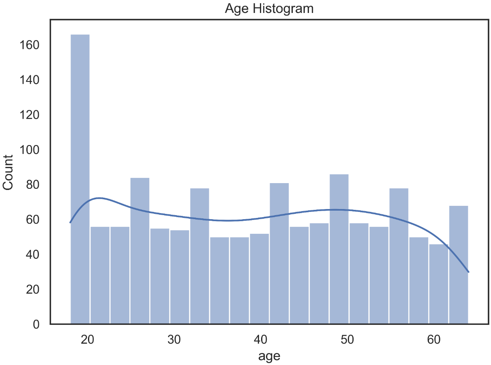
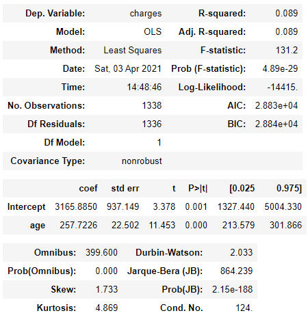
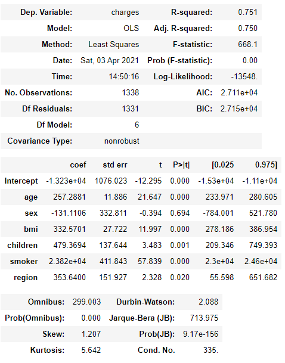
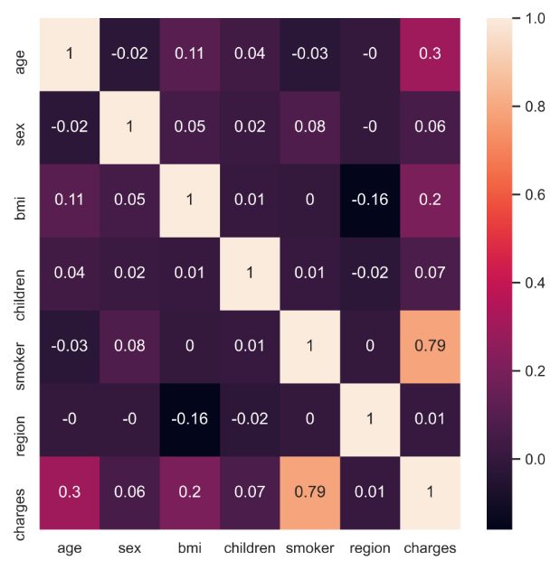
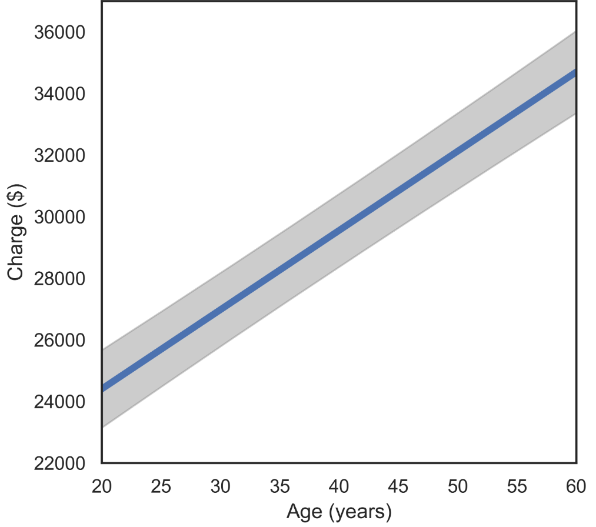
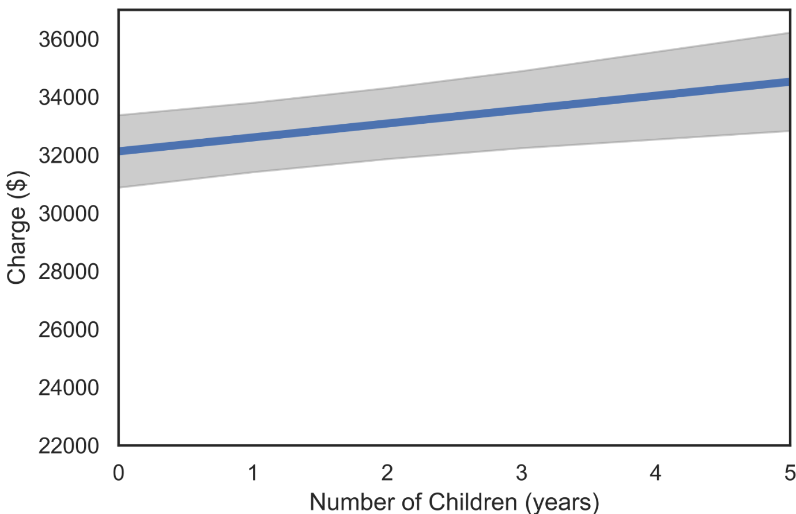
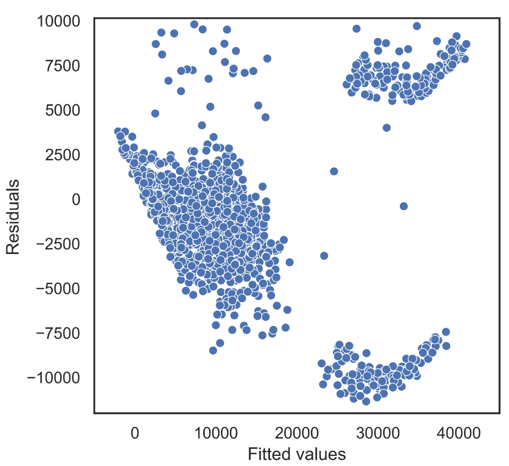

# Medical Insurance Costs

Code: [GitHub](https://github.com/WMaia9/U.S.-Medical-Insurance-Costs)

## Introduction

There is no doubt that health-related benefits are among the most important that a company can offer its employees. After all, they help to significantly reduce medical expenses and guarantee the necessary support in times of difficulty. All of this reflects on the collective well-being and brings positive results for the company.

Among the great advantages of hiring health insurance in organizations, we can mention the greater engagement of the team. This is because employees who have access to quality medical care work with more attention, tranquility and disposition, achieving their best performance during working hours.

Because Medical insurance is a much desired benefit, its offer also helps in attracting and retaining the best professionals in the market. And with great talents working in the company, it tends to become a benchmark for quality in what it does.

In this project we analyses data from US Medical Insurance Costs. Recently many people are looking for this type of insurance and prices can vary widely according to the user's data. The main question of this analysis is to answer the final price that users need to pay.

The dataset `insurance.csv` was provided by Kaggle.com: [Medical Cost Personal Datasets](https://www.kaggle.com/mirichoi0218/insurance)

### Project Goals

In this project are make a case study using the linear regression method on Medical Insurance Costs dataset provided by the kaggle

### Analysis

This solution uses descriptive and inferential statistics and data visualization to find key figures in understanding the distribution, count, and relationship between variables.

### Evaluation

The project concludes with the evaluation of a linear model. A simple case study is done for one variable and then for multiple variables. After that is focused on visualizing the adjusted models then look at the residual plots and the error band.

## Data

The project has one dataset provided by Kaggle called `insurance.csv`. In the data, each row represents an user and the columns are the responses to their user profiles which include data about them.

`insurance` has 1,338 rows and 7 columns, this is a good amount of data to analyze.

Each line, or sample, consists of the following features:

TABLE 2.1: Description of variables in the dataset.

+--------------+----------------------------------------------------------------------------------------------------+
| **Variable** | **Description**                                                                                    |
+==============+====================================================================================================+
| age          | Age of primary beneficiary                                                                         |
+--------------+----------------------------------------------------------------------------------------------------+
| sex          | Client's gender                                                                                    |
+--------------+----------------------------------------------------------------------------------------------------+
| bmi          | Body mass index of the client. BMI is a measure of a person's weight with respect to their height. |
+--------------+----------------------------------------------------------------------------------------------------+
| children     | Numbers of children depending on the client                                                        |
+--------------+----------------------------------------------------------------------------------------------------+
| smoker       | smoker yes or no                                                                                   |
+--------------+----------------------------------------------------------------------------------------------------+
| region       | Region of which the customer is a part                                                             |
+--------------+----------------------------------------------------------------------------------------------------+
| charges      | Annual charge of how much the customer must pay                                                    |
+--------------+----------------------------------------------------------------------------------------------------+

## Exploring the Data

Now let's take a look at the first 5 lines of the Data Frame that we want to analyze.

TABLE 2.2: The 5 first lines of the Data Frame Insurance.

| age |  sex   |  bmi   | children | smoker |  region   | charges |
|:---:|:------:|:------:|:--------:|:------:|:---------:|:-------:|
| 19  | female |  27.9  |    0     |  yes   | southwest | 16884.9 |
| 18  |  male  | 33.77  |    1     |   no   | southeast | 1725.55 |
| 28  |  male  |   33   |    3     |   no   | southeast | 4449.46 |
| 33  |  male  | 22.705 |    0     |   no   | northwest | 21984.5 |
| 32  |  male  | 28.88  |    0     |   no   | northwest | 3866.86 |

Before doing a deeper analysis on the data we can see some of the data and how it is distributed from graphs.

We started by looking at the Age Histogram.

{width="600"}

FIGURE 2.1: The distribution of the Age Histogram.

Then, we can take a look at the scatter graph in the age variable x charge and separated between smokers and non-smokers, as we believe it has a great impact on the value of the final price charged.

{width="700"}

FIGURE 2.2: Scatter plot of chargers vs age between smokers and non-smokers. No-Smoker = 0 and Smoker = 1

As can be seen in FIGURE 2.2, we have a leap in value when we analyze the graphs between smokers and non-smokers. Furthermore, we can see that there is a linear growth between age and the amount charged.

Next, let's look at the BMI distribution:

{width="600"}

FIGURE 2.3: The BMI distribution.

The BMI values are all well distributed in Gaussian. We see that there are no outliers to be lipated.

Knowing that BMI has a well-behaved distribution, we will take a look at how BMI is influenced between the processed value between treatment and untreated.

{width="700"}

FIGURE 2.4: Scatter plot of charges vs BMI between smokers and non-smokers.

Analyzing FIGURE 2.1, we can see that there is a linear growth between BMI and the amount charged when they are smokers, which is not the case for non-smokers.

Taking a first look at the data provided and some plotted graphs, we can see that there are probably relationships between some variables provided and the charge amount. Next we will investigate it.

## Linear Regression

We initially focus on regression models where the amount charged is the dependent variable. That is, we predict the amount charged based on other variables.

Since the feature charge is a quantitative variable, we model it using linear regression.

### Interpreting regression parameters in a basic model

We start with a simple linear regression model with only one covariable, age, to predict the charge. The model that is adjusted expresses the amount charged as a linear function of age.

TABLE 2.3: Linear Regression Model adjusted for age variable using the python statsmodels library.

{width="658"}

The part that starts to be relevant to us of the Table presented is from **coef**. This section contains the estimated values for the parameters of the regression model. Its pattern, errors and other values are used to quantify the uncertainty in the estimates of the regression parameters.

This adjusted model implies that when comparing two people of different ages in one year, the oldest person will have an average of 257. 72 units of charges larger than the youngest person. This difference is statistically significant, based on the p-value showing in the column labeled **'P> \| t \|'**. This means that there is strong evidence that there is a real association between age and charges made by the customer.

To better understand the meaning of the regression parameter 257.7226, we can look at the standard deviation of charges.

The standard deviation of around \$ 12,110 is large compared to the slope of the 258 regression. However, the slope of the regression corresponds to the average change in collection for a single year of age, and this effect accumulates with age. Comparing a 40 year old person with a 60 year old person, there is a 20 year difference, which translates into '20 \* 258 = 5,160 'unit difference in the average value charged between these two people. This difference is about less than half a standard deviation, and is generally considered to be an important and significant change.

### R-square

In the case of regression with a single independent variable, as we have here, there is a very close correspondence between the regression analysis and Pearson's correlation analysis. The R-square is a statistical measure of how close the data is to the adjusted regression line. The value obtained was 0.09, which means that 9% of the variation in the amount charged is explained by the age of the customers.

### Adding more variables to the model

After analyzing a simple linear regression model with only one covariant (age), we use all the variables. The real power of regression happens when we have more than one covariant to predict an output.

TABLE 2.4: Linear Regression Model adjusted for all variables using the python statsmodels library.

{width="666"}

The model that was adjusted in TABLE 2.4 uses all parameters to explain the variation in the amount charged. We can see how interesting the value of R-square is. If we look at the table, we see a value of 0.75, that is, we have a linear regression model that 75% of the variation in the amount charged is probably explained by the variables provided.

Looking at the age coefficient, which we studied earlier, there were no changes even adding many other variables. Thus, we can notice that the age variable has no relation with the other variables provided in the model. It is possible to confirm this result by looking at the value of the correlations between the variables and noting that there is almost no relationship between age and the rest of the other variables.

{width="450"}

FIGURE 2.5: Correlation between variables

## Visualization of the fitted models

In this section we demonstrate some graphing techniques that can be used to gain a better understanding of a regression model that has been fit to data.

We start with plots that allow us to visualize the fitted regression function, that is, the mean charges expressed as a function of the covariates. These plots help to show the estimated role of one variable when the other variables are held fixed. We will also plot 95% *simultaneous confidence bands* around these fitted lines. Although the estimated mean curve is never exact based on a finite sample of data, we can be 95% confident that the true mean curve falls somewhere within the shaded regions of the plots below.

This type of plot requires us to fix the values of all variables other than the independent variable (Charges here), and one independent variable that we call the *focus variable* (which is age here). Below we fix the gender as "female" and the BMI as 25. Thus, the graphs below show the relationship between expected Charges and age for women with BMI equal to 25.

The plot analyzed for the number of children is shown below. Age is 50 with the other parameters the same.

{width="600"}

FIGURE 2.6: Fitted regression function charge vs age.

The analogous plot for Number of Children is shown next. Here we fix the gender as "female" and the age at 50, so we are looking at the relationship between expected charge and age for women of age 50.

{width="600"}

FIGURE 2.7: Fitted regression function charge vs number of children.

The error band for the number of children is noticeably greater than the error band for the age, indicating that there is less certainty in relation to children and charge compared to age and charge.

The discussion so far has primarily focused on the mean structure of the population, that is, the model for the average change of a person with a given age, gender, BMI, smoker, region and children. A regression model can also be used to assess the *variance structure* of the population, that is, how much and in what manner the observations deviate from their mean. We will focus on informal, graphical methods for assessing this.

To begin with, we plot the residuals against the fitted values. Recall that the fitted values are the estimated means for each observation, and the residuals are the difference between an observation and its fitted mean. For example, the model may estimate that a 50 year old female will have on average an charge of 32, 000 \$. But a specific 50 year old female may have a blood pressure of 110 or 150, for example. The fitted values for both of these women are 32, 000, and their residuals are -10,000, and 10,000, respectively.

The simplest variance pattern that we can see in a linear regression occurs when the points are scattered around the mean, with the same degree of scatter throughout the range of the covariates. When there are multiple covariates, it is hard to assess whether the variance is uniform throughout this range, but we can easily check for a "mean/variance relationship", in which there is a systematic relationship between the variance and the mean, i.e. the variance either increases or decreases systematically with the mean. The plot of residuals on fitted values is used to assess whether such a mean/variance relationship is present.

{width="600"}

FIGURE 2.8: Fitted values vs Residuals.

Above we show the plot of residuals on fitted values for the Insurance data. It appears that we have a modestly increasing mean/variance relationship.

## Conclusion

As can be seen, the linear regression model is a very powerful tool for analyzing model predictions if more than one variable is used. Using the python statsmodels library, we saw how easy and very useful it is to analyze statistical models.
