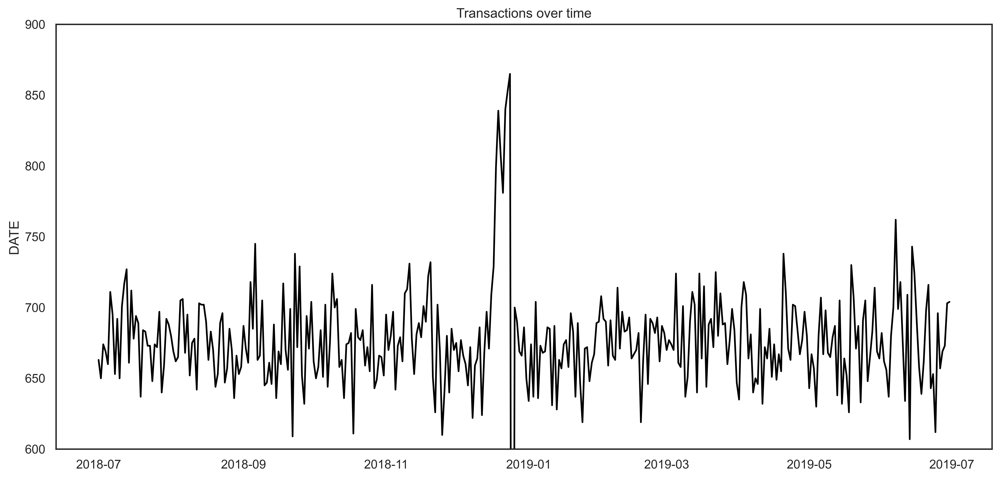
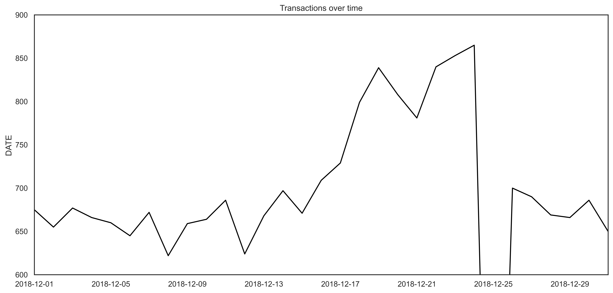
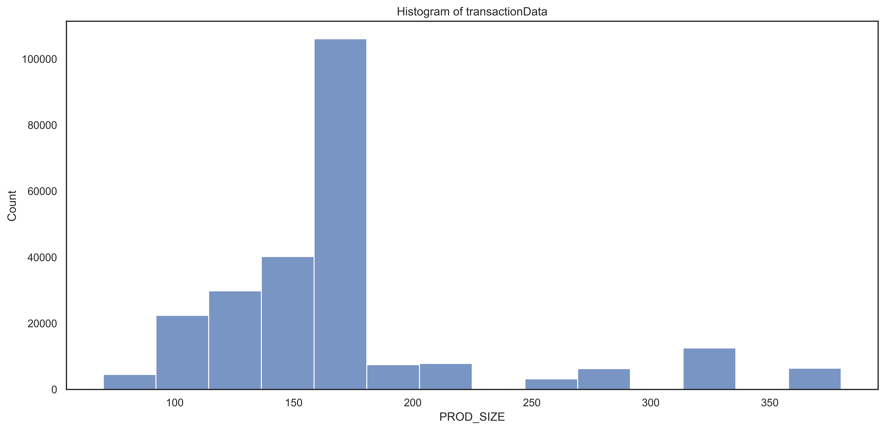
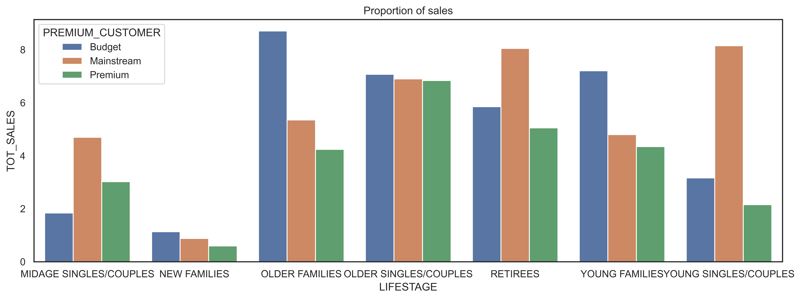
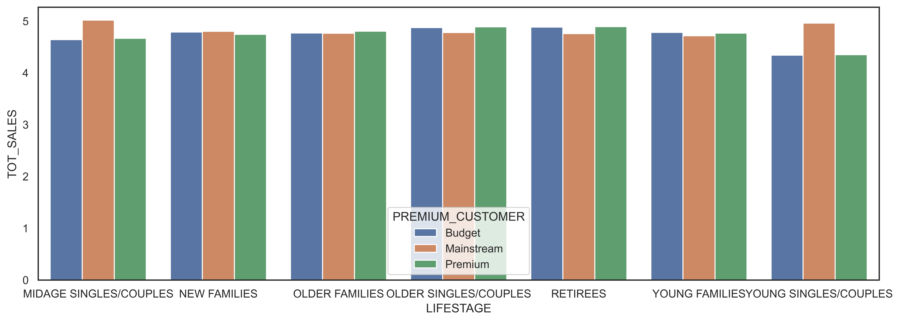

# Quantium Retail Strategy and Analytics

Code: [GitHub](https://github.com/WMaia9/Quantium-Retail-Strategy-and-Analytics)

## Introduction

This work is part of the virtual internship program of the company Quantium.

Quantium is a Data Science company that helps companies with insights and models looking to improve their performance.

Quantium has had a data partnership with a major supermarket brand in recent years, which provides transactional and customer data.

The analysis is based on Quantium chip data to better understand the types of customers who buy chips and their buying behavior in the region.

The analysis insights serve to feed the supermarket's strategic plan for the chip category.

## Data

The first step in any analysis is to first understand the data. Let's take a look at each of the datasets provided.

## Exploring the Data

Starting with the analysis of the dataset transaction, let's look at the first few lines.

### Examining transaction data

| DATE  | STORE | LYLTY_CARD | TXN_ID | PROD |                   NAME                   | QTY | TOT_SALES |
|:-----:|:-----:|:----------:|:------:|:----:|:----------------------------------------:|:---:|:---------:|
| 43390 |   1   |    1000    |   1    |  5   |     Natural Chip Compny SeaSalt175g      |  2  |     6     |
| 43599 |   1   |    1307    |  348   |  66  |          CCs Nacho Cheese 175g           |  3  |    6.3    |
| 43605 |   1   |    1343    |  383   |  61  |  Smiths Crinkle Cut Chips Chicken 170g   |  2  |    2.9    |
| 43329 |   2   |    2373    |  974   |  69  |  Smiths Chip Thinly S/Cream&Onion 175g   |  5  |    15     |
| 43330 |   2   |    2426    |  1038  | 108  | Kettle Tortilla ChpsHny&Jlpno Chili 150g |  3  |   13.8    |

As we are only interested in words that tell us if the product is chips or not, let's remove all words with digits and special characters such as '&' from our set of product words.

There are salsa products in the dataset but we are only interested in the chips category, so let's remove these.

Next, we can check summary statistics such as mean, min and max values for each feature to see if there are any obvious outliers in the data and if there are any nulls in any of the columns

|       |  STORE |      QTY | TOT_SALES | PROD_SIZE |
|:------|-------:|---------:|----------:|----------:|
| count | 246740 |   246740 |    246740 |    246740 |
| mean  | 135.05 |  1.90646 |   7.31611 |   175.584 |
| std   | 76.787 | 0.342499 |    2.4749 |   59.4321 |
| min   |      1 |        1 |       1.7 |        70 |
| 25%   |     70 |        2 |       5.8 |       150 |
| 50%   |    130 |        2 |       7.4 |       170 |
| 75%   |    203 |        2 |       8.8 |       175 |
| max   |    272 |        5 |      29.5 |       380 |

There are no nulls in the columns but product quantity appears to have an outlier which we should investigate further. Let's investigate further the case where 200 packets of chips are bought in one transactions.

| DATE       | STORE | LYLTY_CARD | TXN_ID | PROD | PROD_NAME               | QTY | TOT_SALES | PROD_SIZE |
|:-----------|------:|-----------:|-------:|-----:|:------------------------|----:|----------:|----------:|
| 2018-08-19 |   226 |     226000 | 226201 |    4 | dorito corn chp supreme | 200 |       650 |       380 |
| 2019-05-20 |   226 |     226000 | 226210 |    4 | dorito corn chp supreme | 200 |       650 |       380 |

There are two transactions where 200 packets of chips are bought in one transaction and both of these transactions were by the same customer. Let's see if the customer has had other transactions

| DATE       | STORE | LYLTY_CARD | TXN_ID | PROD | NAME                    | PROD_QTY | TOT_SALES | PROD_SIZE |
|:-----------|------:|-----------:|-------:|-----:|:------------------------|---------:|----------:|----------:|
| 2018-08-19 |   226 |     226000 | 226201 |    4 | dorito corn chp supreme |      200 |       650 |       380 |
| 2019-05-20 |   226 |     226000 | 226210 |    4 | dorito corn chp supreme |      200 |       650 |       380 |

It looks like this customer has only had the two transactions over the year and is not an ordinary retail customer. The customer might be buying chips for commercial purposes instead. We remove this loyalty card number from further analysis.

|       |  STORE |      QTY | TOT_SALES | PROD_SIZE |
|:------|-------:|---------:|----------:|----------:|
| count | 246740 |   246740 |    246740 |    246740 |
| mean  | 135.05 |  1.90646 |   7.31611 |   175.584 |
| std   | 76.787 | 0.342499 |    2.4749 |   59.4321 |
| min   |      1 |        1 |       1.7 |        70 |
| 25%   |     70 |        2 |       5.8 |       150 |
| 50%   |    130 |        2 |       7.4 |       170 |
| 75%   |    203 |        2 |       8.8 |       175 |
| max   |    272 |        5 |      29.5 |       380 |

That's better. Now,looking at the number of transaction lines over time to see if there are any obvious data issues such as missing data, we see that is missing a value. There's only 364 rows, meaning only 364 dates which indicates a missing date.

figure 1

{width="900"}

Zooming in on the data to take a closer look:

{width="900"}

We can see that the increase in sales occurs in the lead-up to Christmas and that there are zero sales on Christmas day itself. This is due to shops being closed on Christmas day.

Now that we are satisfied that the data no longer has outliers, we can move on to creating other features such as brand of chips or pack size from PROD_NAME. We start with pack size.

The largest size is 380g and the smallest size is 70g - seems sensible!

Let's plot a histogram of PACK_SIZE since we know that it is a categorical variable and not a continuous variable even though it is numeric.

figure3

{width="900"}

### Examining customer data

Now that we are happy with the transaction dataset, let's have a look at the customer dataset.

| LYLTY_CARD_NBR | LIFESTAGE              | PREMIUM_CUSTOMER |
|---------------:|:-----------------------|:-----------------|
|           1000 | YOUNG SINGLES/COUPLES  | Premium          |
|           1002 | YOUNG SINGLES/COUPLES  | Mainstream       |
|           1003 | YOUNG FAMILIES         | Budget           |
|           1004 | OLDER SINGLES/COUPLES  | Mainstream       |
|           1005 | MIDAGE SINGLES/COUPLES | Mainstream       |

We will now join the two data using the python merge function.

| DATE       | LYLTY_CARD_NBR | TXN_ID | PROD_NBR | PROD_NAME                           | QTY | TOT_SALES | SIZE | LIFESTAGE              | PREMIUM_CUSTOMER |
|:-----------|---------------:|-------:|---------:|:------------------------------------|----:|----------:|-----:|:-----------------------|:-----------------|
| 2018-10-17 |           1000 |      1 |        5 | natural chip compny seasalt         |   2 |         6 |  175 | YOUNG SINGLES/COUPLES  | Premium          |
| 2019-05-14 |           1307 |    348 |       66 | ccs nacho cheese                    |   3 |       6.3 |  175 | MIDAGE SINGLES/COUPLES | Budget           |
| 2019-05-20 |           1343 |    383 |       61 | smiths crinkle cut chips chicken    |   2 |       2.9 |  170 | MIDAGE SINGLES/COUPLES | Budget           |
| 2018-08-17 |           2373 |    974 |       69 | smiths chip thinly cream onion      |   5 |        15 |  175 | MIDAGE SINGLES/COUPLES | Budget           |
| 2018-08-18 |           2426 |   1038 |      108 | kettle tortilla chpshny jlpno chili |   3 |      13.8 |  150 | MIDAGE SINGLES/COUPLES | Budget           |

As the number of rows in 'result' is the same as that of 'transactionData', we can be sure that no duplicates were created. This is because we created 'result' by setting a left join which means take all the rows in 'transactionData' and find rows with matching values in shared columns and then join the details in these rows to the 'x' or the first mentioned table.

## Data analysis on customer segments

Now that the data is ready for analysis, we can define some metrics of interest to the client: - Who spends the most on chips (total sales), describing customers by lifestage and how premium their general purchasing behaviour is - How many customers are in each segment - How many chips are bought per customer by segment - What's the average chip price by customer segment

Let's start with calculating total sales by LIFESTAGE and PREMIUM_CUSTOMER and plotting the split by these segments to describe which customer segment contributes most to chip sales.

                                              TOT_SALES
    PREMIUM_CUSTOMER LIFESTAGE                        
    Budget           MIDAGE SINGLES/COUPLES   33345.70
                     NEW FAMILIES             20607.45
                     OLDER FAMILIES          156863.75
                     OLDER SINGLES/COUPLES   127833.60
                     RETIREES                105916.30
                     YOUNG FAMILIES          129717.95
                     YOUNG SINGLES/COUPLES    57122.10
    Mainstream       MIDAGE SINGLES/COUPLES   84734.25
                     NEW FAMILIES             15979.70
                     OLDER FAMILIES           96413.55
                     OLDER SINGLES/COUPLES   124648.50
                     RETIREES                145168.95
                     YOUNG FAMILIES           86338.25
                     YOUNG SINGLES/COUPLES   147582.20
    Premium          MIDAGE SINGLES/COUPLES   54443.85
                     NEW FAMILIES             10760.80
                     OLDER FAMILIES           75242.60
                     OLDER SINGLES/COUPLES   123537.55
                     RETIREES                 91296.65
                     YOUNG FAMILIES           78571.70
                     YOUNG SINGLES/COUPLES    39052.30

Plotting the bar graph of the data, we have:

{width="900"}

Sales are coming mainly from Budget - older families, Mainstream - young singles/couples, and Mainstream - retirees

Let's see if the higher sales are due to there being more customers who buy chips.

                                             TOT_SALES
    PREMIUM_CUSTOMER LIFESTAGE                        
    Budget           MIDAGE SINGLES/COUPLES   35514.80
                     NEW FAMILIES             21928.45
                     OLDER FAMILIES          168363.25
                     OLDER SINGLES/COUPLES   136769.80
                     RETIREES                113147.80
                     YOUNG FAMILIES          139345.85
                     YOUNG SINGLES/COUPLES    61141.60
    Mainstream       MIDAGE SINGLES/COUPLES   90803.85
                     NEW FAMILIES             17013.90
                     OLDER FAMILIES          103445.55
                     OLDER SINGLES/COUPLES   133393.80
                     RETIREES                155677.05
                     YOUNG FAMILIES           92788.75
                     YOUNG SINGLES/COUPLES   157621.60
    Premium          MIDAGE SINGLES/COUPLES   58432.65
                     NEW FAMILIES             11491.10
                     OLDER FAMILIES           81958.40
                     OLDER SINGLES/COUPLES   132263.15
                     RETIREES                 97646.05
                     YOUNG FAMILIES           84025.50
                     YOUNG SINGLES/COUPLES    41642.10

Plotting again:

{width="900"}

There are more Mainstream - young singles/couples and Mainstream - retirees who buy chips. This contributes to there being more sales to these customer segments but this is not a major driver for the Budget - Older families segment.

Higher sales may also be driven by more units of chips being bought per customer.

Let's have a look at this next.

{width="900"}

Mainstream mid aged and young singles and couples are more willing to pay more per packet of chips compared to their budget and premium counterparts. This may be due to premium shoppers being more likely to buy healthy snacks and when they buy chips, this is mainly for entertainment purposes rather than their own consumption. This is also supported by there being fewer premium mid aged and young singles and couples buying chips compared to their mainstream counterparts.

As the difference in average price per unit isn't large, we can check if this difference is statistically different.

The t-test results \< 2.2e-16, i.e. the unit price for mainstream, young and mid-age singles and couples are significantly higher than that of budget or premium, young and mid age singles and couples.

## Deep dive into specific customer segments for insights

We have found quite a few interesting insights that we can dive deeper into. We might want to target customer segments that contribute the most to sales to retain them or further increase sales. Let's look at Mainstream - young singles/couples. For instance, let's find out if they tend to buy a particular brand of chips.

    MIDAGE SINGLES/COUPLES
    smiths crinkle chips salt   vinegar     194
    cheezels cheese                         186
    doritos corn chips  nacho cheese        179
    kettle chilli                           179
    cobs popd sour crm   chives chips       176

    YOUNG SINGLES/COUPLES
    tostitos splash of  lime                335
    kettle mozzarella   basil   pesto       332
    doritos corn chips  cheese supreme      326
    smiths crnkle chip  orgnl big bag       323
    kettle tortilla chpshny jlpno chili     323

We can see that : - Mainstream young singles/couples are 23% more likely to purchase Tyrrells chips compared to the rest of the population - Mainstream young singles/couples are 56% less likely to purchase Burger Rings compared to the rest of the population

Let's also find out if our target segment tends to buy large packs of chips.

    MIDAGE SINGLES/COUPLES
    175.0    2975
    150.0    1777
    134.0    1159
    110.0    1124
    170.0     882

    MIDAGE SINGLES/COUPLES
    175.0    2975
    150.0    1777
    134.0    1159
    110.0    1124
    170.0     882

Both the segment buy 175g, 150g and 134g packets mostly

## Conclusion

Sales have mainly been due to Budget - older families, Mainstream - young singles/couples, and Mainstream - retirees shoppers. We found that the high spend in chips for mainstream young singles/couples and retirees is due to there being more of them than other buyers. Mainstream, midage and young singles and couples are also more likely to pay more per packet of chips. This is indicative of impulse buying behavior.

We've also found that Mainstream young singles and couples are 23% more likely to purchase Tyrrells chips compared to the rest of the population. The Category Manager may want to increase the category's performance by off-locating some Tyrrells and smaller packs of chips in discretionary space near segments where young singles and couples frequent more often to increase visibility and impulse behavior.

Quantium can help the Category Manager with recommendations of where these segments are and further help them with measuring the impact of the changed placement. We'll work on measuring the impact of trials in the next task and putting all these together in the third task.
