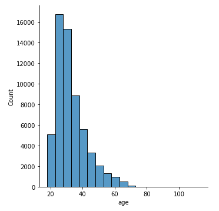

# Ok Cupid: Machine Learning Astrological Sign Prediction

## Introduction

This project analyzes data from on-line dating application OKCupid. In recent years, there has been a massive rise in the usage of dating apps to find love. Many of these apps use sophisticated data science techniques to recommend possible matches to users and to optimize the user experience. These apps give us access to a wealth of information that we've never had before about how different people experience romance.

**Data sources:**

`okcupid_profiles.csv` was provided by Kaggle.com: [OkCupid Profiles](https://www.kaggle.com/andrewmvd/okcupid-profiles)

### Project Goals

In this project, the goal is to analyze the data from Kaggle using tools of Data Science. The primary research question that will be answered is whether an OkCupid's user astrological sign can be predicted using other variables from their profiles.

### Data

The project has one data set provided by Kaggle called `okcupid_profiles.csv`. In the data, each row represents an OkCupid user and the columns are the responses to their user profiles which include multi-choice and short answer questions.

### Analysis

This solution uses descriptive statistics and data visualization to find key figures in understanding the distribution, count, and relationship between variables. Since the goal of the project is to make predictions on the user's astrological signs, classification algorithms from the supervised learning family of machine learning models are implemented.

### Evaluation

The project concludes with the evaluation of the machine learning model selected with a validation data set. The output of the predictions can be checked through a confusion matrix, and metrics such as accuracy, precision, recall, F1 and Kappa scores.

## Knowing the Data

To analyze the user profiles from OkCupid, pandas will be used to load the dataset into a `DataFrame` so that it can be explored and visualized with Python.

#### Data Characteristics

`profiles` has 59,946 rows and 31 columns, this is a good sign since there seems to be enough data for machine learning.

The columns in the dataset include:

-   **age:** continuous variable of age of user
-   **body_type:** categorical variable of body type of user
-   **diet:** categorical variable of dietary information
-   **drinks:** categorical variable of alcohol consumption
-   **drugs:** categorical variable of drug usage
-   **education:** categorical variable of educational attainment
-   **ethnicity:** categorical variable of ethnic backgrounds
-   **height:** continuous variable of height of user
-   **income:** continuous variable of income of user
-   **job:** categorical variable of employment description
-   **offspring:** categorical variable of children status
-   **orientation:** categorical variable of sexual orientation
-   **pets:** categorical variable of pet preferences
-   **religion:** categorical variable of religious background
-   **sex:** categorical variable of gender
-   **sign:** categorical variable of astrological symbol
-   **smokes:** categorical variable of smoking consumption
-   **speaks:** categorical variable of language spoken
-   **status:** categorical variable of relationship status
-   **last_online:** date variable of last login
-   **location:** categorical variable of user locations

And a set of open short-answer responses to :

-   **essay0:** My self summary
-   **essay1:** What I'm doing with my life
-   **essay2:** I'm really good at
-   **essay3:** The first thing people usually notice about me
-   **essay4:** Favorite books, movies, show, music, and food
-   **essay5:** The six things I could never do without
-   **essay6:** I spend a lot of time thinking about
-   **essay7:** On a typical Friday night I am
-   **essay8:** The most private thing I am willing to admit
-   **essay9:** You should message me if...

## Explore the Data

First to be explored is the number of unique signs, and the values. It seems that there are 48, but there should only be 12 signs. Upon closer inspection, there seems to be qualifiers attached with the signs.

### Continuous Variables

#### age

The next plot shows the distribution of age in the group. It seems that most users are in their late 20s to early 30s.

Here is the same chart but broken down by gender. It seems that there are proportionally similar breaks of gender by age, but slightly fewer females overall.

fig 2

#### Height

The next plot shows the height variable. most people look like they are between 1.5 and 2 meters tall.

fig 3

Here is the same height chart showing the breakdown by gender. It seems obvious, but females tend to be shorter than males and look to have a normal distribution.

#### Income

Here is the data of income, it seems that the majority of the participants do not include their income figures.

fig 4

### Discrete Variables

#### Sex

Previously it was identified that there are more males in the data, and it seems that there are \~35,000 men to \~25,000 women.

fig 5

#### Body Type

The next chart shows the body type variable, and it seems that most users will describe themselves as average, fit, or athletic.

fig 6

The next chart shows the breakdown of body type by gender and it seems that some of the body type descriptions are highly gendered. For example "curvy" and "full figured" are highly female descriptions, while males use "a little extra", and "overweight" more often.

fig 7

#### Diet

Here is a chart of the dietary information for users. Most users eat "mostly anything", followed by "anything", and "strictly anything", being open-minded seems to be a popular signal to potential partners.

fig 8

#### Drinks

The next plot shows that the majority of the users drink "socially", then "rarely" and "often".

fig 9

#### Drugs

The vast majority of users "never" use drugs.

fig 10

#### Smoking

Similarly for drugs the majority of users chose "no" for smoking.

fig 11

#### Education

Below you can see the majority of users are graduates from college/university followed by masters programs and those working on college/university. Interestingly space camp related options are fairly popular options.

fig 12

#### Jobs

Most users don't fit into the categories provided, but there are a fair share of students, artists, tech, and business folks.

fig 13

#### Offspring

The data suggest that most users do not have kids.

fig 14

#### Orientation

The majority of users are straight.

fig 15

#### Pets

The chart shows that most users like or have dogs.

fig 16

#### Religion

Religion was similar to sign where there are a lot of qualifiers.

religion was cleaned to take the first word and distilled down to 9 groups. The majority was not very religious identifying as agnostic, other, or atheists.

fig 17

#### Signs

Here are the astrological signs of the users. They are mainly evenly distributed with Capricorns being the rarest and Leos being the most common.

fig 18

#### Status

The relationship status for a dating website is fairly predictable. One would assume that most people are single and available which is reflected in the data.

fig 19

### Data Preparation

#### Missing Data

Missing data is often not handled by machine learning algorithms well and have to be checked so they may need to be imputed or removed. It seems that many of the columns do have missing values.

-   TODO
