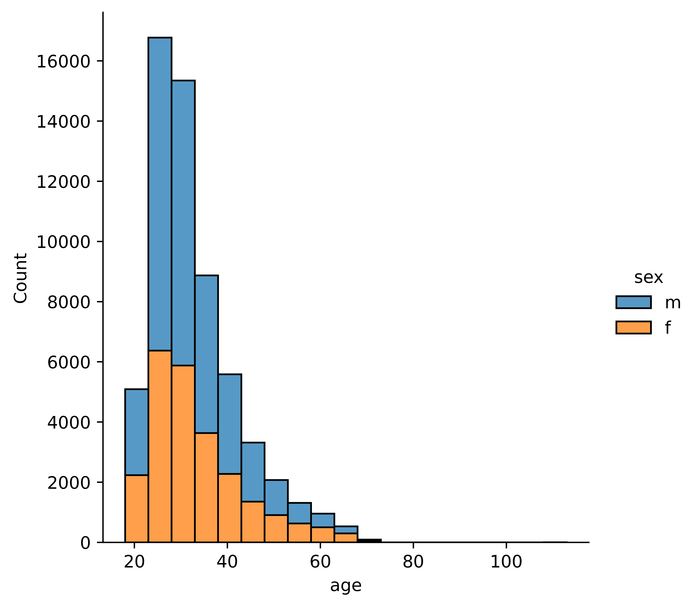

# Ok Cupid

Code: [GitHub](https://github.com/WMaia9/OK-Cupid-ML)

## Introduction

This project analyzes data from on-line dating application OKCupid. In recent years, there has been a massive rise in the usage of dating apps to find love. Many of these apps use sophisticated data science techniques to recommend possible matches to users and to optimize the user experience. These apps give us access to a wealth of information that we've never had before about how different people experience romance.

The dataset `okcupid_profiles.csv` was provided by Kaggle.com: [OkCupid Profiles](https://www.kaggle.com/andrewmvd/okcupid-profiles)

### Project Goals

In this project, the goal is to analyze the data from Kaggle using tools of Data Science. The primary research question that will be answered is whether an OkCupid's user astrological sign can be predicted using other variables from their profiles.

### Analysis

This solution uses descriptive statistics and data visualization to find key figures in understanding the distribution, count, and relationship between variables. Since the goal of the project is to make predictions on the user's astrological signs, classification algorithms from the supervised learning family of machine learning models are implemented.

### Evaluation

The project concludes with the evaluation of the machine learning model selected with a validation data set. The output of the predictions can be checked through a confusion matrix, and metrics such as accuracy, precision, recall, F1 and Kappa scores.

## Data

The project has one data set provided by Kaggle called `okcupid_profiles.csv`. In the data, each row represents an OkCupid user and the columns are the responses to their user profiles which include multi-choice and short answer questions.

To analyze the user profiles from OkCupid, pandas will be used to load the dataset into a `DataFrame` so that it can be explored and visualized with Python.

### Data Characteristics

`profiles` has 59,946 rows and 31 columns, this is a good sign since there seems to be enough data for machine learning.

The columns in the dataset include:

TABLE 4.1: Description of variables in the dataset.

|              |                                                |
|--------------|:-----------------------------------------------|
| **Variable** | **Description**                                |
| age          | categorical variable of educational attainment |
| body_type    | categorical variable of body type of user      |
| diet         | categorical variable of dietary information    |
| drinks       | categorical variable of alcohol consumption    |
| drugs        | categorical variable of drug usage             |
| education    | categorical variable of educational attainment |
| ethnicity    | categorical variable of ethnic backgrounds     |
| height       | continuous variable of height of user          |
| income       | continuous variable of income of user          |
| job          | categorical variable of employment description |
| offspring    | categorical variable of children status        |
| orientation  | categorical variable of sexual orientation     |
| pets:        | categorical variable of pet preferences        |
| religion     | categorical variable of religious background   |
| sex          | categorical variable of gender                 |
| sign         | categorical variable of astrological symbol    |
| smokes       | categorical variable of smoking consumption    |
| speaks       | categorical variable of language spoken        |
| status       | categorical variable of relationship status    |
| last_online  | date variable of last login                    |
| location     | categorical variable of user locations         |

And a set of open short-answer responses to :

TABLE 4.2: Description of variables short-answer in the dataset.

| **Variable** | **Description**                                |
|--------------|------------------------------------------------|
| essay0       | My self summary                                |
| essay1       | What I'm doing with my life                    |
| essay2       | I'm really good at                             |
| essay3       | The first thing people usually notice about me |
| essay4       | Favorite books, movies, show, music, and food  |
| essay5       | The six things I could never do without        |
| essay6       | I spend a lot of time thinking about           |
| essay7       | On a typical Friday night I am                 |
| essay8       | The most private thing I am willing to admit   |
| essay9       | You should message me if...                    |

## Exploring the Data

Let's start by looking at the first rows and columns of our dataset:

TABLE 4.3: The 5 first lines of the Data Frame.

| age | status    | sex | orientation | body_type      | drinks   | drugs     | education                         |
|-----|-----------|-----|-------------|----------------|----------|-----------|-----------------------------------|
| 22  | single    | m   | straight    | a little extra | socially | never     | working on college/university     |
| 35  | single    | m   | straight    | average        | often    | sometimes | working on space camp             |
| 38  | available | m   | straight    | thin           | socially | nan       | graduated from masters program    |
| 23  | single    | m   | straight    | thin           | socially | nan       | working on college/university     |
| 29  | single    | m   | straight    | athletic       | socially | never     | graduated from college/university |

First to be explored is the number of unique signs, and the values. It seems that there are 48, but there should only be 12 signs.

It is important that we clean the labels since this is what will be predicted and 48 predictions would be quite difficult. By taking the first word of the column, the signs can be saved without the qualifiers. The qualifiers could be used for another problem down the line.

After adjusting the signs, we can better analyze them on our dataset.

### Continuous Variables

#### age

The next plot shows the distribution of age in the group. It seems that most users are in their late 20s to early 30s.

{width="500"}

Here is the same chart but broken down by gender. It seems that there are proportionally similar breaks of gender by age, but slightly fewer females overall.

{width="500"}

#### Height

The next plot shows the height variable. most people look like they are between 1.5 and 2 meters tall.

{width="500"}

Here is the same height chart showing the breakdown by gender. It seems obvious, but females tend to be shorter than males and look to have a normal distribution.

{width="500"}

#### Income

Here is the data of income, it seems that the majority of the participants do not include their income figures.

{width="500"}

### Discrete Variables

#### Sex

{width="500"}

Previously it was identified that there are more males in the data, and it seems that there are \~35,000 men to \~25,000 women.

#### Body Type

The next chart shows the body type variable, and it seems that most users will describe themselves as average, fit, or athletic.

{width="500"}

The next chart shows the breakdown of body type by gender and it seems that some of the body type descriptions are highly gendered. For example "curvy" and "full figured" are highly female descriptions, while males use "a little extra", and "overweight" more often.

{width="500"}

#### Diet

Here is a chart of the dietary information for users. Most users eat "mostly anything", followed by "anything", and "strictly anything", being open-minded seems to be a popular signal to potential partners.

{width="500"}

#### Drinks

The next plot shows that the majority of the users drink "socially", then "rarely" and "often".

{width="500"}

#### Drugs

The vast majority of users "never" use drugs.

{width="500"}

#### Smoking

Similarly for drugs the majority of users chose "no" for smoking.

{width="500"}

#### Education

Below you can see the majority of users are graduates from college/university followed by masters programs and those working on college/university. Interestingly space camp related options are fairly popular options.

{width="500"}

#### Jobs

Most users don't fit into the categories provided, but there are a fair share of students, artists, tech, and business folks.

{width="500"}

#### Offspring

The data suggest that most users do not have kids.

{width="500"}

#### Orientation

The majority of users are straight.

{width="500"}

#### Pets

The chart shows that most users like or have dogs.

{width="500"}

#### Religion

Religion was similar to sign where there are a lot of qualifiers.

{width="500"}

religion was cleaned to take the first word and distilled down to 9 groups. The majority was not very religious identifying as agnostic, other, or atheists.

{width="500"}

#### Signs

Here are the astrological signs of the users. They are mainly evenly distributed with Capricorns being the rarest and Leos being the most common.

{width="500"}

#### Status

The relationship status for a dating website is fairly predictable. One would assume that most people are single and available which is reflected in the data.

{width="500"}

## Data Preparation

Missing data is often not handled by machine learning algorithms well and have to be checked so they may need to be imputed or removed. It seems that many of the columns do have missing values.

Preparing the data for modeling is important since it can speed up the process and produce better models. As the adage goes, "garbage in garbage out" so we want to make sure the data we are inputting into our modelling step is good enough to share with others.

The data for the model is going to be a subset of the variables. The variables were selected because they might be a good predictor for astrological signs, where some of the variables that were not selected such as `age` is probably not a good indicator.

Missing values are dropped to create a fully complete data set.

Furthermore, an imbalance in the prediction label needs to be checked. This is important since it's a multi-class problem where two or more outcomes can be bad. An imbalance in a response variable is bad since it means that some labels only occur a few times. This is an issue for machine learning algorithms if there is not enough data to train with which will give bad predictions.

In the given dataset, we observe that the counts of all the zodiac signs are more or less equal (i.e., without large deviations). Hence, we do not have to worry about imbalances and trying to address this problem.

Next the data was split into train and validation sets. In this split 25% of the data is reserved for the final validation, while 75% is kept for training the model.

## Prediction

### Model building

Now it's time to create some models, here is a list of [Multi class models](https://scikit-learn.org/stable/modules/multiclass.html) available in scikit learn. For this project three common algorithms will be used to make predictions.

Below, the respective modules for Logistic Regression, Decision Trees, and KNN are loaded.

### Evaluation Metrics

In the models, there will be several values that can be evaluated below is a quick diagram:  here is a quick description of the metrics:

-   **Accuracy:** is the correct values divided by total values
-   **Precision:** is the True Positives divided by the sum of True Positives and False Negatives. So precision is the values of the true positives divided by the actual positive values.
-   **Recall:** is the True Positives divided by the sum of True Positives and False Positives. So recall is the values of the true positives divided by the positive guesses.
-   **F1-score:** is a blended score of precision and recall which balances both values.
-   **Macro Avg:** is the unweighted mean value of precision and recall.
-   **Weighted Avg:** is the weighted mean value of precision and recall by the support values for each class.
-   **Support:** is the number of observations in class to predict.

### Logistic Regression

The first model is using logistic regression with the `multi_class="multinomial"` argument. Using `lr_model` predictions are created from the training dataset which is used to figure out how well the model performed.

                  precision    recall  f1-score   support

        aquarius       0.13      0.06      0.08       930
           aries       0.13      0.11      0.12      1012
          cancer       0.13      0.20      0.15      1067
       capricorn       0.14      0.05      0.08       921
          gemini       0.12      0.12      0.12      1116
             leo       0.12      0.18      0.15      1123
           libra       0.13      0.12      0.13       992
          pisces       0.12      0.11      0.12      1026
     sagittarius       0.12      0.06      0.08       993
         scorpio       0.12      0.08      0.09      1013
          taurus       0.12      0.14      0.13      1051
           virgo       0.13      0.21      0.16      1095

        accuracy                           0.12     12339
       macro avg       0.12      0.12      0.12     12339
    weighted avg       0.12      0.12      0.12     12339

The final accuracy of the logistic regression model is 12% which is terrible considering a random guess should result in being correct \~8% of the time (1/12).

### K Nearest Neighbor

The next model is the `KNeighborsClassifier` which will take 20 of it's neighbors to predict the signs. The default value for `n_neighbors` is 5 which was kept. This number can be tuned later on if needed.

                  precision    recall  f1-score   support

        aquarius       0.26      0.66      0.37       930
           aries       0.26      0.53      0.35      1012
          cancer       0.30      0.44      0.35      1067
       capricorn       0.34      0.37      0.35       921
          gemini       0.34      0.32      0.33      1116
             leo       0.40      0.28      0.33      1123
           libra       0.38      0.23      0.29       992
          pisces       0.42      0.25      0.31      1026
     sagittarius       0.43      0.23      0.30       993
         scorpio       0.42      0.22      0.29      1013
          taurus       0.42      0.25      0.31      1051
           virgo       0.42      0.23      0.29      1095

        accuracy                           0.33     12339
       macro avg       0.36      0.33      0.32     12339
    weighted avg       0.37      0.33      0.32     12339

This model had a 33% accuracy which is a good sign.

### Decision Trees

The last model is the decision tree, the default `max_depth` is `none` which means that it will "If None, then nodes are expanded until all leaves are pure or until all leaves contain less than min_samples_split samples.".

                  precision    recall  f1-score   support

        aquarius       0.66      0.94      0.78       930
           aries       0.67      0.89      0.76      1012
          cancer       0.70      0.87      0.78      1067
       capricorn       0.73      0.84      0.78       921
          gemini       0.76      0.79      0.78      1116
             leo       0.80      0.79      0.80      1123
           libra       0.79      0.76      0.78       992
          pisces       0.81      0.74      0.77      1026
     sagittarius       0.88      0.70      0.78       993
         scorpio       0.89      0.71      0.79      1013
          taurus       0.94      0.67      0.78      1051
           virgo       0.91      0.67      0.77      1095

        accuracy                           0.78     12339
       macro avg       0.80      0.78      0.78     12339
    weighted avg       0.80      0.78      0.78     12339

The results are very promising because it has a 78% accuracy with this model.

Below is a confusion matrix of the results with the true values on the y axis and predicted values along the x axis. Since the diagonals are lighter in color and have higher numbers, the accuracy is going to be high since those are the True Positives.

{width="600"}

Going back to the model, a quick analysis shows that this tree model has a depth of 65 branches, which probably not generalize to another dataset. In this case this model has been "overfit" for this data.

To make a point, a five fold cross validation is created with the same data. The results are worse than the KNN and about the Logistic Regression algorithms. the baseline was \~9%

The decision tree model will be made again, but with a `max_depth` of 20 to stop the algorithm from reaching the stopping point.

                  precision    recall  f1-score   support

        aquarius       0.40      0.33      0.36       930
           aries       0.40      0.27      0.32      1012
          cancer       0.40      0.28      0.33      1067
       capricorn       0.27      0.30      0.28       921
          gemini       0.37      0.26      0.31      1116
             leo       0.37      0.25      0.30      1123
           libra       0.59      0.19      0.29       992
          pisces       0.19      0.44      0.26      1026
     sagittarius       0.40      0.23      0.29       993
         scorpio       0.64      0.20      0.30      1013
          taurus       0.39      0.25      0.31      1051
           virgo       0.16      0.47      0.24      1095

        accuracy                           0.29     12339
       macro avg       0.38      0.29      0.30     12339
    weighted avg       0.38      0.29      0.30     12339

The new accuracy rate of \~41% is worse than the first iteration, but slightly better than the KNN model.

If we check again with cross validation, the new model is still averaging \~8% which is not very good.

                  precision    recall  f1-score   support

        aquarius       0.08      0.20      0.11       332
           aries       0.09      0.18      0.12       316
          cancer       0.09      0.13      0.11       390
       capricorn       0.05      0.06      0.05       276
          gemini       0.08      0.08      0.08       380
             leo       0.10      0.07      0.08       393
           libra       0.08      0.05      0.06       362
          pisces       0.07      0.04      0.05       308
     sagittarius       0.09      0.04      0.06       319
         scorpio       0.07      0.03      0.05       343
          taurus       0.08      0.05      0.06       339
           virgo       0.14      0.08      0.10       356

        accuracy                           0.08      4114
       macro avg       0.09      0.08      0.08      4114
    weighted avg       0.09      0.08      0.08      411

### Final Model

So it seems that the `knn_model` might be the best model for OkCupid to use when users don't have their signs listed on their user profile. By using the hold out or validation set, we get \~8% accuracy which is not very good.

    precision    recall  f1-score   support

        aquarius       0.08      0.22      0.12       294
           aries       0.09      0.18      0.12       345
          cancer       0.09      0.15      0.11       328
       capricorn       0.06      0.06      0.06       315
          gemini       0.08      0.06      0.07       366
             leo       0.10      0.07      0.08       395
           libra       0.10      0.06      0.08       326
          pisces       0.07      0.05      0.06       337
     sagittarius       0.08      0.03      0.05       347
         scorpio       0.08      0.04      0.05       355
          taurus       0.07      0.04      0.05       345
           virgo       0.08      0.05      0.06       361

        accuracy                           0.08      4114
       macro avg       0.08      0.08      0.08      4114
    weighted avg       0.08      0.08      0.07      4114

In the confusion matrix, it becomes clear that Cancer, Gemini, Leo, and Virgo was predicted most often, but were not super accurate since the vertical color band represents even distributed guesses mostly wrong and some correct.

{width="600"}

## Conclusion

In this project, machine learning was used to predict the astrological signs of OkCupid users. This is an interesting feature, as many people believe in astrology and combinations between compatible star signs. If users do not enter their signals, an algorithmic solution may have generated a signal to input the missing data when making matches.

Unfortunately, the final algorithm selected was no better than basic guessing, showing that not everything is appropriate for using machine learning as many people say out there.
