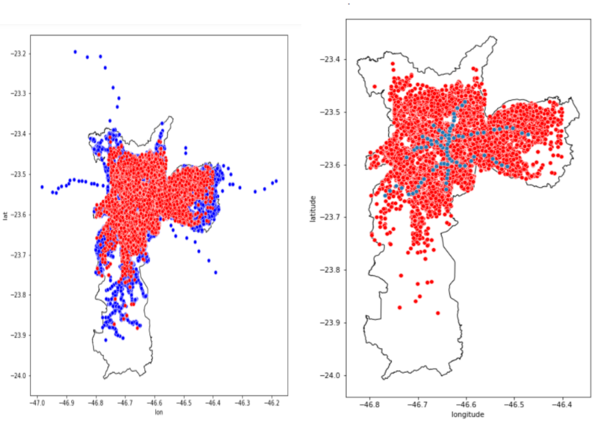
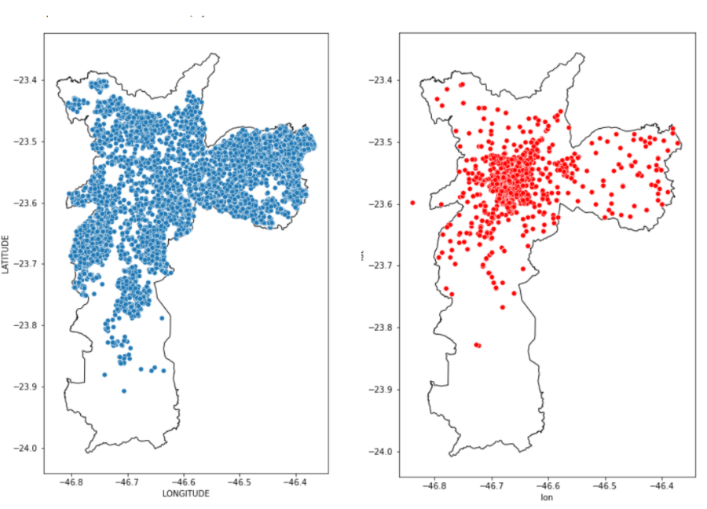
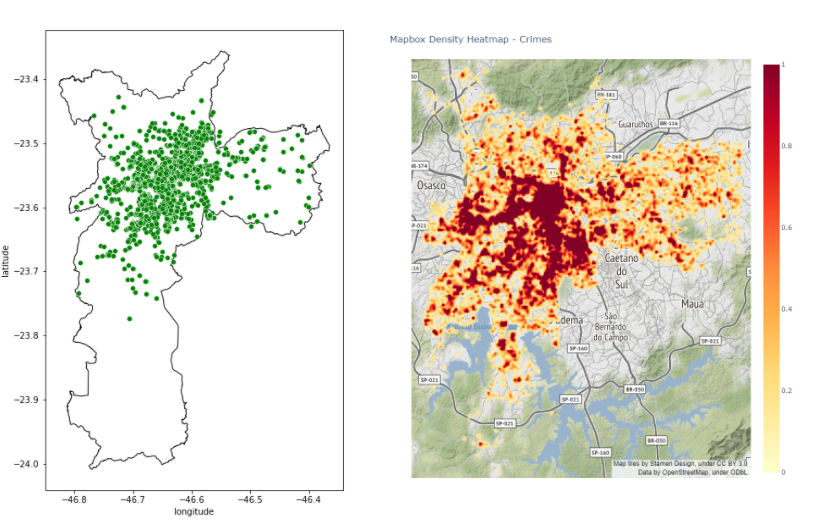
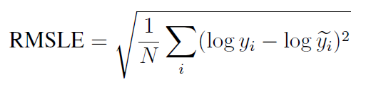
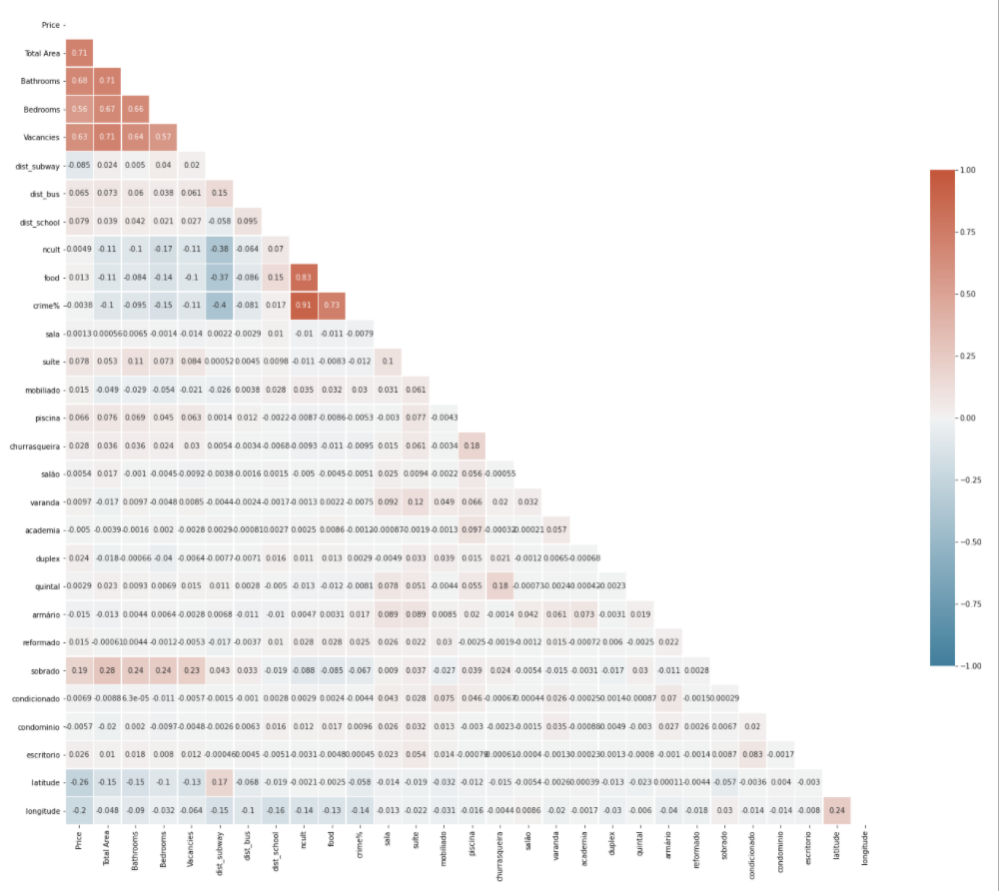
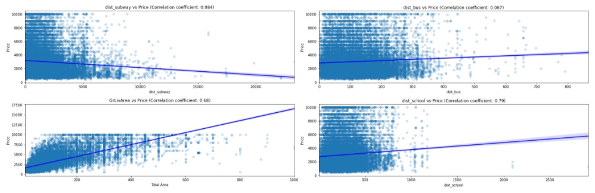
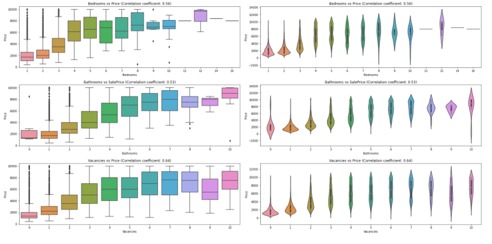
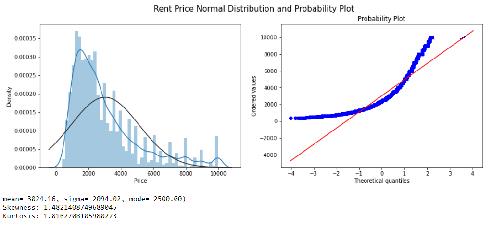
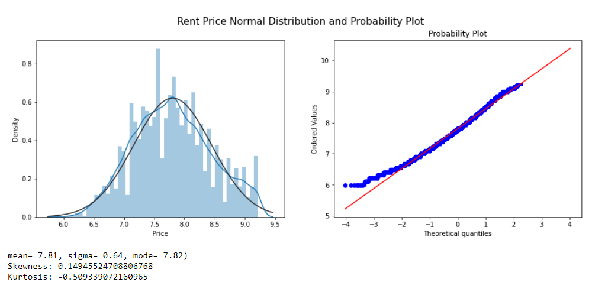
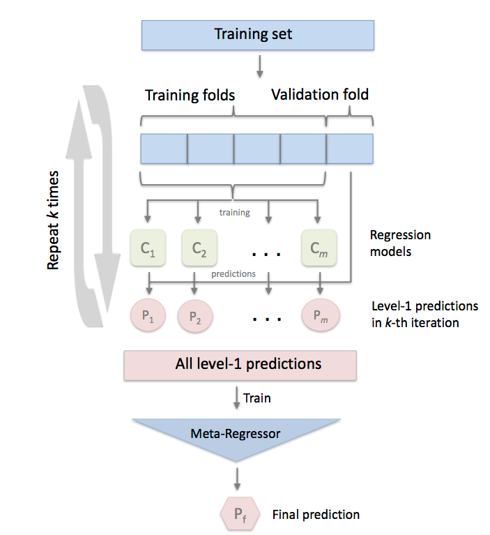

# Real Estate São Paulo Rent Prediction

Code: [GitHub](https://github.com/WMaia9/rent-prediction)

Web App: [sp-rent-predictions](https://share.streamlit.io/wmaia9/sprentweb/main/sprent.py)

## Introduction

Everyone needs a place to live. It can be a house, a flat or an apartment. Everyone, at some point in life, is faced with the choice of buying or renting a house. On top of that, the following questions can be asked: Is buying a property worthwhile or staying in rent is the best alternative? In a society that values and idealizes the dream of home ownership, those who question themselves about the subject end up being seen as crazy.

After all, from an early age, we are led to believe that home ownership is a goal that everyone should have and strive to achieve. This, however, is not an absolute truth.

Furthermore, having a home, for many, is synonymous with stability and security. But, is it really worth buying a house? Or can continuing to rent make more sense?

Let's point out some of the reasons that it makes sense to rent and why this is such an attractive business:

1.  **Renting is not synonymous with losing money**

> Considering the fixed income, depending on how the interest rates are, for example, it is more worthwhile to continue renting and invest the money that was reserved for the home itself. Thus, it is possible to pay the lease with the proceeds and save the rest to, who knows, buy it later.
>
> After all, the vast majority of people do not buy their house in cash and resort to financing. And this type of business is not advantageous, as the person ends up assuming a debt for years, and the amount to be paid for the property can even triple in comparison with the original value of the property.
>
> In this way, it can be much more worthwhile to invest your money - making it work for you - and to continue renting, paying this expense (or part of it) with the income.

2.  **Property is not an investment**

> It is important to keep in mind that owning a home is only for the sake of the family and does not generate any profit. With this new acquisition, debts such as property tax and other taxes, maintenance expenses and a series of repairs that may appear will come.
>
> Certainly your money will be invested there, but it can both appreciate - with the appreciation of the good itself over the years - as well as devalue itself. Not to mention that the money is immobilized, causing you to lose liquidity.

3.  **The property is not yours until it is paid off**

> The property is not yours! Yes, the apartment will be yours only after paying off the debt. That is, you will only be the owner after the twenty years that you were paying for the good! Is it worth it to spend all that time paying off a debt? Depending on the contract signed, you will only be the owner after a few decades
>
> In addition to the reasons mentioned above, São Paulo is a very busy city and many people go to it to work or study for a while, and renting makes a lot more sense than buying.
>
> Regardless of the reasons for renting, the sides need to agree on a price. It is always good to know how much a property is worth, what the expected transaction price is.

### Analysis

In this work, we want to find an answer to these questions. This case study is intended to be a comprehensive use case of how to deal with a regression problem for Data Science. We will start with some questions that allow us to understand the problems related to the price of renting a property.

The owner does not know how to increase the value of the property so that the investment is less than the added value. For example, building a swimming pool can increase the price and forming a bathroom is not worth it.

The owner does not know how much he is going to rent a property. He makes an offer on the portal and doesn't know if the price is right,

The tenant does not know how much the property is worth.

These are some of the questions that can be asked. As a definition of our problem, we define the property's valuation, and through explanations we try to get an answer depending on the position we choose.

Initially we will see how the literature says what the amount should be charged in a rent.

According to, the basic rule most used to calculate rent is to apply a value between 0.5% and 1%, per month, on the market value of the property. This means that if the property is worth R\$ 100 thousand, the rent must be between R\$ 500 and R\$ 1,000 per month. Research shows that, on average, two- and three-bedroom houses and apartments, the rental price is 0.75%.

But there are many variables that make up the rent calculation. The real estate market itself regulates itself and pricing the rental price of properties by supply and demand. Supply and demand is an important concept of the Liberal Economy.

The characteristics of the property itself are also decisive in the calculation of rent. Similar properties in the same region of the city, in general, have approximate values. That is why it is always important to observe the values ​​in force in the real estate market in the region in which you will invest or prospect your property for business.

There are cases of similar properties in the same neighborhood that may have different rentals. This is justified by the commercial and transport structure available. Factors such as the total length of the property, leisure facilities, swimming pool, party room, condominium, concierge services, security, garage, number of rooms influence the calculation of rent

An apartment or house, for example, close to bus or metro stations may have a higher rental price than a more remote one. The same goes for properties in regions with supermarkets, pharmacies and bakeries located next to a park.

With this premise, we can now analyze the data.

## Data

As a data source for information on property characteristics and prices, a set of data obtained from a web scraper on the Zap Imóveis website was used. Web Scraper is a tool with the purpose of extracting data from a HyperText Markup Language (HTML) website. The web scraper was developed by GeovRodri based on Beautiful Soup and made available through the link: [zapimoveis-scraper](https://pypi.org/project/zapimoveis-scraper/)

The set of data collected on the website is based on rental advertisements in the city of São Paulo containing more than 60 thousand data. The data set obtained contains the data according to TABLE 5.1.

TABLE 5.1.1: Description of variables in the dataset.

| **Variable**  | **Description**                     |
|---------------|-------------------------------------|
| description   | property description                |
| price         | price (monthly)                     |
| bedrooms      | number of bedrooms on property      |
| bathrooms     | number of bathrooms on property     |
| total_area_m2 | property area (square meters)       |
| vacancies     | parking spots available on property |
| address       | property address                    |
| link          | link of the property                |

Another idea on how to enrich our solution was to add external data. Our hypothesis took into account the information given in the introduction of how a property is calculated, therefore, a location of the property can significantly affect the price. Therefore, we also take into account the distance to the nearest public transport (Metro and bus), distance to the nearest school, number of cultural variety within 1km and addition to the crime rate in the region.

### Data Preparation

Like all automatic data collection processes, the web scraper described above generated data with quality problems. To solve this problem, we apply some cleaning processes. The first filter was to remove instances that had null values (absent) for attributes considered fundamental for the analysis. To eliminate outliers that left the data inconsistent, such as, for example, rent with sale price of properties, places with more than 50 bathrooms and houses with areas the size of a city, conditions were added for the property to be considered consistent with reality.

### External data

External data has been added. We believe that many other variables describe the rental price. Geospatial information was missing. Why do some places tend to be more expensive? Perhaps it is because of the availability of public transport. That is why we decided to add, for example, a variable that describes the distance to the nearest bus or metro station.

In the data described, we note that unfortunately there is no zip code and geolocation of the properties. To our happiness, the website provides address, and from that it was possible to use a geolocation tool called [Geopy](https://geopy.readthedocs.io/en/stable/) available for Python. With it it is possible to enter an address and automatically the library provides you with the longitude and latitude of the location.

After obtaining the geolocation values of the properties, a second cleaning was performed on the data. Many registrations and inconsistencies of Geopy cause some locations of the respective properties to be outside the city of São Paulo (curiously some even in the middle of the Atlantic Ocean). To solve this problem, we took the official data from the location of the city of São Paulo, made available by [IBGE](https://www.ibge.gov.br/) and with the help of [Geopandas](https://geopandas.org/), we applied the data so that all the properties in our database were within the region.

After another treatment of data, we added variables that describe the distances to the bus, subway station and school closest to the property. The data were obtained from the [GeoSampa](http://geosampa.prefeitura.sp.gov.br/PaginasPublicas/_SBC.aspx) website provided by the city of São Paulo.

Another reason we took into account for the price of renting the property was that they may be more expensive because of some interesting places around, such as museums, galleries, shopping centers or libraries. These places are not just stand-alone facilities, but are connected to other infrastructure, which is generally expected to increase the price. For this variable, we consider a radius of 700 meters chosen arbitrarily. The data were again obtained from the GeoSampa website.

With the same situation in mind, we also added a variable called "food" to calculate the number of places to eat within a radius of 700 meters. We consider restaurants, bars, cafes, among others. To obtain the data, we use the [Overpass Turbo](https://overpass-turbo.eu/) site which is a web based data mining tool for [OpenStreetMap](https://www.openstreetmap.org/).

Finally, we also decided to add a crime rate variable around real estate, as we believe that more violent places tend to have lower rent values. The data were obtained through the [Geospatial São Paulo Crime Database](https://www.kaggle.com/danlessa/geospatial-sao-paulo-crime-database) made available by Kaggle.

The data can be viewed in FIGURE X. There are 21367 bus stops, 89 metro stations, 4761 schools, 1697 cultural points and 12899 crime data.

TABLE 5.1.2: Description of the external variables in the dataset.

| **Variable** | **Description**                                      |
|:-------------|:-----------------------------------------------------|
| Id           | property Id                                          |
| Type         | house / apartment                                    |
| Region       | region of the city                                   |
| dist_subway  | distance from properly to the nearest subway station |
| dist_bus     | distance from properly to the nearest bus station    |
| school       | distance from properly to the nearest school         |
| ncult        | number of cult place in area of the property         |
| food         | number of food place in area of the property         |
| crime%       | \% of crime in property area                         |
| latitude     | latitude of the property                             |
| longitude    | longitude of the property                            |
| items        | Items of the property                                |

{width="681"}

FIGURE 5.1: Spatial external data. Stops Bus on the left and Subway Station on the right. Each point indicates the location of the property (marked in red). The blue and indicate the location of public transport stops. On the x-axis we have longitude values, while on the y-axis we have latitude values.

{width="691"}

FIGURE 5.2: Spatial external data. Schools on the left and cultural places on the right.

{width="754"}

FIGURE 5.3: Food Place on the left and heatmap of crime rate on the right

Most cultural locations are located in the city center. Thus, this variable also tells the story of how much city center the property has. As all these places are in the center of the city, these other points must reflect some local centers.

As can be seen in the figure, bus stops and schools are very dense across the city. Showing that all properties have a good connection to public transport and education. This can, for example, facilitate the movement of children to schools and parents to workplaces. But the problem of transport via the Metro is evident on the map. We see that it covers a very small region of the city, being that it is the fastest means of transport, which probably properties in its surroundings must have rents much more expensive than the rest of the region.

In the last figure, we plot the density of crime in the city. We see that the center has a much higher density than the rest of the region.

After doing this localization step, an id was created for the locations, noting that the property link exists a unique id for each one of them. This was important to eliminate duplicate data.

The last step was to divide the data into training and test samples at random with a 70/30 ratio to apply machine learning.

The script to download, clean and process the data can be found on GitHub. For the analysis of spatial data, a small geofast script was made. The distances between 2 arbitrary points on the earth can be obtained in the Geopy package for Python. However, the general equation is very computationally expensive for the purpose of this work. Then an adjustment was made in our case without losing almost any precision. A simple equation of geospatial calculation was used that can be applied for short distances of a few hundred kilometers.

### Text Processing

To extract information from the title and description, we followed the regular Natural Language Processing pipeline, which encompasses tokenization (splitting sentences into separate words), removal of common unhelpful words such as prepositions (stopwords removal), and lemmatization (reduction of words to their root forms).

From the texts we add variables that we think are important for the price of the property. For example, if it is a townhouse, if it has a swimming pool, barbecue, if it is furnished and so on.

## Model

In this project, We will be using the linear model as a base model to finalize the data pre-processing steps. We will use outlier removal techniques, coding techniques, sizing / normalization techniques, resource engineering and different types of imputation combinations.

We divided the modeling into five steps.

**Step1: Linear Models**

In this step We used linear models like Linear Regression, Bayesian Ridge Regression, Lasso, Elastic Net and Ridge.

**Step2: Support Vector Machines**

We used SVR(Support Vector Regressor). Similar to linear models for SVR also.

**Step3: Ensemble Methods**

In first two steps We used basic models, from step 3 onward models becomes complex. We used models like Gradient Boosting Regressor, LightGBM Regressor, XGB Regressor.

**Step4: Model Stacking**

Stacking is an ensemble learning technique to combine multiple regression models via a meta-regressor. At this stage we have good mix of multiple models, now is the best time to use StackingCVRegressor to combine all above models to improve the score even further. As expected this model resulted in best possible score!

**Step5: Model Blending**

Model blending is the manual step, where we manually adjust the weight for each model in order to ensemble the predictions to improve the score. Thumb rle is to give highest weights to best performing model and lowest to least performing model. After few trial and and error I could settle on the weights and manage to top my model stacking score!

### **Root Mean Square Error (RMSE)**

Root Mean square is the standard deviation of the residuals. Now let's understand what Standard deviation and residuals are.

**Standard deviation**: Standard deviation is a measure of how spread out numbers are. Its formula is the square root of the Variance. Variance is defined as the average of the squared differences from the Mean. In the below formula of standard deviation 'xi'= numbers, 'μ'= Mean of the numbers and 'N' = Total number of values

**Residuals**: Residuals are a measure of how far from the regression line data points are. Residuals are nothing but prediction error, we can find it by subtracting the predicted value from actual value.

In order to get RMSE we will use Standard deviation formula but instead of square root of variance we will calculate the square root of average of squared residuals.

Standard deviation is used to measure the spread of data around the mean, while RMSE is used to measure distance between predicted and actual values.

RMSE is a measure of how spread out these residuals are. In other words, it tells you how concentrated the data is around the line of best fit.

{width="228"}

Since the errors are squared before they are averaged, the RMSE gives a relatively high weight to large errors. This means the RMSE is most useful when large errors are particularly undesirable. Note that, as per competition rules submissions are evaluated on the logarithm of the predicted value and the logarithm of the observed sales price. Taking logs means that errors in predicting expensive houses and cheap houses will affect the result equally.

-   **What does RMSE indicate?**:

    -   It indicates the absolute fit of the model to the data.

    -   Provides average model prediction error in units of the variable of interest.

    -   They are negatively-oriented scores, which means lower values are better.

### **Correlation Check**

Correlation is a measure of the linear relationship of 2 or more variables. Through correlation, we can predict one variable from the other. The logic behind using correlation for feature selection is that the good variables are highly correlated with the target.

A correlation matrix is a table showing correlation coefficients between variables. Each cell in the table shows the correlation between two variables.

We will use **Pearson's correlation**. It is utilized we you have two quantitative variables and you wish to see if there is a linear relationship between those variables.

FIGURE 5.4: Correlation Map of the variables.

In above correlation map:

-1 indicates a perfectly negative linear correlation between two variables.

0 indicates no linear correlation between two variables.

1 indicates a perfectly positive linear correlation between two variables.

### **Multicollinearity Analysis**

Multicollinearity refers to a situation in which more than two explanatory variables in a multiple regression model are highly linearly related. Below are few of the multicollinear features based on correlation matrix.

{width="938"}

FIGURE 5.5: Correlation of Price vs dist subway, dist bus, dist school and live area.

FIGURE 5.5: Boxplot of correlation of Price vs numbers Bathrooms, Bedrooms and Vacancies

### **Feature Engineering**

#### **Numeric Feature Scaling**

In order to give every feature the same importance we perform feature scaling. There are many techniques like Min-Max Scaler, Robust Scaler etc. to do feature scaling.

Before we can finalize any scaling technique let's check the skewness of our numeric features. Skewness is the measure of degree of asymmetry of a distribution:

-   skewness = 0 : normally distributed.

-   skewness > 0 : more weight in the left tail of the distribution.

-   skewness \< 0 : more weight in the right tail of the distribution.

#### **Target Variable Analysis and Transformation**

Price is our target variable. If we want to predict the target variables accurately then the first task is to understand the underlying behavior of our target variable. Note that model can make more reliable predictions if our target variable is normally distributed. We will use both graphical and statistical methods to do a normality test of our target variable.

**Statistical**

We will use Skewness, Kurtosis and Shapiro-Wilk test for normality.

-   Skewness assesses the extent to which a variable's distribution is symmetrical. The thumb rule is,

    -   If the skewness is between -0.5 and 0.5, the data are fairly symmetrical.

    -   If the skewness is between -1 and -- 0.5 or between 0.5 and 1, the data are moderately skewed.

    -   If the skewness is less than -1 or greater than 1, the data are highly skewed.

-   Kurtosis tells you the height and sharpness of the central peak, relative to that of a standard bell curve. The thumb rule is,

    -   Kurtosis greater than +1 indicates distribution is too peaked.

    -   Kurtosis less than --1 indicates a distribution that is too flat.

FIGURE 5.6: Rent Price Normal Distribution

From a normal distribution plot it's clear that the mean is greater than mode, similarly from the probability plot we can see that most of the observations fall on the lower end of the Y axis. So we can conclude that that the target variable 'Price' is right skewed. There are multiple transformation techniques to handle the skewed data. We use log transformation.

FIGURE 5.6: Rent Price Normal Distribution after apply Log

## Prediction

### **Linear Models**

#### **Linear Regression**

Linear Regression fits a linear model with coefficients w = (w1, ..., wp) to minimize the residual sum of squares between the observed targets in the dataset, and the targets predicted by the linear approximation.

TABLE 5.2: Results for Random Forest with 5-Fold Cross-Validation.

| RMSLE on Training (CV = 5) | RMSLE on Test |
|:--------------------------:|:-------------:|
|      0.3829 ± 0.0050       |    0.3798     |

#### **Bayesian Ridge Regression**

Bayesian Ridge estimates a probabilistic model of the regression. Bayesian regression techniques can be used to include regularization parameters in the estimation procedure: the regularization parameter is not set in a hard sense but tuned to the data at hand.

-   The advantages of Bayesian Regression are:

    -   It adapts to the data at hand.

    -   It can be used to include regularization parameters in the estimation procedure.

-   The disadvantages of Bayesian regression include:

    -   Inference of the model can be time consuming.

TABLE 5.3: Results for Random Forest with 5-Fold Cross-Validation.

| RMSLE on Training (CV = 5) | RMSLE on Test |
|:--------------------------:|:-------------:|
|      0.3829 ± 0.0050       |    0.3797     |

#### **Lasso**

Linear Model trained with L1 prior as regularizer.

TABLE 5.4: Results for Lasso with 5-Fold Cross-Validation.

| RMSLE on Training (CV = 5) | RMSLE on Test |
|:--------------------------:|:-------------:|
|      0.3831 ± 0.0050       |    0.3801     |

#### **Elastic Net**

Linear regression with combined L1 and L2 priors as regularizer.

TABLE 5.5: Results for Elastic Net with 5-Fold Cross-Validation.

| RMSLE on Training (CV = 5) | RMSLE on Test |
|:--------------------------:|:-------------:|
|      0.4064 ± 0.0031       |    0.4035     |

#### Ridge

Linear least squares with l2 regularization. This model solves a regression model where the loss function is the linear least squares function and regularization is given by the l2-norm. Also known as Ridge Regression or Tikhonov regularization. This estimator has built-in support for multi-variate regression (i.e., when y is a 2d-array of shape (n_samples, n_targets)).

TABLE 5.6: Results for Ridge with 5-Fold Cross-Validation.

| RMSLE on Training (CV = 5) | RMSLE on Test |
|:--------------------------:|:-------------:|
|      0.4064 ± 0.0031       |    0.4035     |

#### **Support Vector Machines**

Support vector machines (SVMs) are a set of supervised learning methods used for classification, regression and outliers detection. The model produced by Support Vector Regression depends only on a subset of the training data, because the cost function ignores samples whose prediction is close to their target.

TABLE 5.7: Results for Support Vector Machines with 5-Fold Cross-Validation.

| RMSLE on Training (CV = 5) | RMSLE on Test |
|:--------------------------:|:-------------:|
|      0.3461 ± 0.0064       |    0.3427     |

### **Ensemble Methods**

The goal of ensemble methods is to combine the predictions of several base estimators built with a given learning algorithm in order to improve generalizability / robustness over a single estimator.

Two families of ensemble methods are usually distinguished:

> In **averaging methods**, the driving principle is to build several estimators independently and then to average their predictions. On average, the combined estimator is usually better than any of the single base estimator because its variance is reduced. Examples: Bagging methods, Forests of randomized trees,etc
>
> By contrast, in **boosting methods**, base estimators are built sequentially and one tries to reduce the bias of the combined estimator. The motivation is to combine several weak models to produce a powerful ensemble. Examples: AdaBoost, Gradient Tree Boosting, etc

#### **Gradient Boosting Regressor**

GBR supports a number of different loss functions for regression which can be specified via the argument loss; the default loss function for regression is least squares ('ls').

TABLE 5.8: Results for Gradient Boosting with 5-Fold Cross-Validation.

| RMSLE on Training (CV = 5) | RMSLE on Test |
|:--------------------------:|:-------------:|
|      0.3148 ± 0.0050       |    0.3128     |

#### **LightGBM Regressor (Light Gradient Boosting Machine)**

LightGBM is a gradient boosting framework based on decision trees to increases the efficiency of the model and reduces memory usage. It uses two novel techniques: Gradient-based One Side Sampling and Exclusive Feature Bundling (EFB) which fulfills the limitations of histogram-based algorithm that is primarily used in all GBDT (Gradient Boosting Decision Tree) frameworks.

TABLE 5.9: Results for LightGBM with 5-Fold Cross-Validation.

| RMSLE on Training (CV = 5) | RMSLE on Test |
|:--------------------------:|:-------------:|
|      0.3152 ± 0.0038       |    0.3198     |

#### **XGB Regressor**

XGBoost is a decision-tree-based ensemble Machine Learning algorithm that uses a gradient boosting framework. XGBoost stands for "Extreme Gradient Boosting" We can use it to solve classification and regression problems. The XGBoost is a popular supervised machine learning model with characteristics like computation speed, parallelization, and performance.

TABLE 5.10: Results for XGBoost with 5-Fold Cross-Validation.

| RMSLE on Training (CV = 5) | RMSLE on Test |
|:--------------------------:|:-------------:|
|      0.3164 ± 0.0040       |    0.3124     |

### **Model Stacking**

#### Stacking CV Regressor

An ensemble-learning meta-regressor for stacking regression. Stacking is an ensemble learning technique to combine multiple regression models via a meta-regression. The StackingCVRegressor extends the standard stacking algorithm (implemented as StackingRegressor) using out-of-fold predictions to prepare the input data for the level-2 regressor. In the standard stacking procedure, the first-level regressors are fit to the same training set that is used to prepare the inputs for the second-level regressor, which may lead to overfitting.

The StackingCVRegressor, however, uses the concept of out-of-fold predictions: the dataset is split into k folds, and in k successive rounds, k-1 folds are used to fit the first level regressor. In each round, the first-level regressors are then applied to the remaining 1 subset that was not used for model fitting in each iteration. The resulting predictions are then stacked and provided -- as input data -- to the second-level regressor. After the training of the StackingCVRegressor, the first-level regressors are fit to the entire dataset for optimal predictions.

Ref. <http://rasbt.github.io/mlxtend/user_guide/regressor/StackingCVRegressor/>

{width="421"}

FIGURE 5.7: Stacking Model

TABLE 5.11: Results for Stacking CV Regressor with 5-Fold Cross-Validation.

| RMSLE on Training (CV = 5) | RMSLE on Test |
|:--------------------------:|:-------------:|
|      0.3112 ± 0.0048       |    0.3198     |

#### **Model Blending**

And finally We use Model Blending to combine all models together.

TABLE 5.12: Results for Model Blending with 5-Fold Cross-Validation.

| RMSLE on Training | RMSLE on Test |
|:-----------------:|:-------------:|
|      0.2973       |    0.2923     |

### Summary

TABLE 5.13: Summary all models

|         Model          | RMSLE on Training | RMSLE on Test |
|:----------------------:|:-----------------:|:-------------:|
|   Linear Regression    |  0.3829 ± 0.0051  |    0.3798     |
|     Bayesian Ridge     |  0.4134 ± 0.0031  |    0.4145     |
|         Lasso          |  0.3831 ± 0.0050  |    0.3801     |
|      Elastic Net       |  0.4064 ± 0.0031  |    0.4035     |
|         Ridge          |  0.4064 ± 0.0031  |    0.4035     |
| Support Vector Machine |  0.3461 ± 0.0064  |    0.3427     |
|   Gradient Boosting    |  0.3148 ± 0.0050  |    0.3128     |
|        LightGBM        |  0.3152 ± 0.0038  |    0.3198     |
|         XGBoot         |  0.3164 ± 0.0040  |    0.3124     |
|      Stakcing CV       |  0.3112 ± 0.0048  |    0.3198     |
|        Blending        |      0.2973       |    0.2923     |

## Use Case of the Model

Having the model trained, tested and explained, it is time for the use cases.

The first application can be someone who wants to rent a house and is looking for more attractive values. With the model it is possible to search for regions of interest and find out if the rental amount that the owner is charging is worth or not. In addition, it is possible to search for properties by price ranges.

The second application is for the owner who wanted to rent his property. Knowing the value of the region he is in, he can make the value of his rent much more competitive against the competition of people who are also selected for renting. In addition, he can estimate with variables what is possible to add to his property or as options in the region to increase the value.

## Conclusion

Predicting real estate rent prices from online advertisements in Brazil is a task which requires insight into the data combined with powerful ML algorithms. Many locations in the city of São Paulo do not have standards in the choice of price, which makes it very difficult for machine learning models. In this work, we applied 9 different methods for this task, and combined them into a final prediction. We provided a strong baseline to overcome, as our final ensemble hit a score of 0.2973 RMSLE showing how powerful the combined model methods are.

For future work, we can make a web scraper again on the site, take images of the properties and apply a covolutional neural network, an aggression that could help in the accuracy of the model with real photos inside the properties.
