# Hotmart Sales Analytics

Code: [GitHub](https://github.com/WMaia9/hotmart)

## Introdução

Esse trabalho é parte de um desafio proposto pela empresa Hotmart.

Hotmart é uma empresa global de tecnologia e educação, com uma plataforma online para distribuição e venda de produtos digitais.

A análise deste trabalho é baseada em uma amostra de compras feita na Hotmart no ano de 2016. Tratam-se de 1,5 milhão de registros de compras realizados na plataforma.

## Dados

O primeiro passo em qualquer análise é entender os dados. Vamos dar uma olhada no dataset disponibilizado.

Os dados são disponibilizados pela Hotmart e se trata de uma amostra de compras feita pela Hotmart em 2016. Vamos começar carregando os dados e conferindo cada um deles e seu tipo.

Podemos ver que o dataset tem 1599829 amostras e 14 colunas. De acordo com a Hotmart, cada campo significa:

| Variáveis                       | Descrição                                                                                                                                                             |
|----------------|--------------------------------------------------------|
| purchase_id                     | Identificação da compra na Hotmart                                                                                                                                    |
| product_id                      | Identificação do produto na Hotmart;                                                                                                                                  |
| affiliate_id                    | Identificação do afiliado na Hotmart;                                                                                                                                 |
| producer_id                     | Identificação do produtor na Hotmart;                                                                                                                                 |
| buyer_id                        | Identificação do comprador na Hotmart;                                                                                                                                |
| purchase_date                   | Data e hora em que a compra foi realizada;                                                                                                                            |
| product_creation_date           | Data e hora em que o produto foi criado na Hotmart;                                                                                                                   |
| product_category                | categoria do produto na Hotmart. Exemplo: e-book, software, curso online, e-tickets, etc.;                                                                            |
| product_niche                   | nicho de mercado que o produto faz parte. Exemplo: educação, saúde e bem-estar, sexualidade, etc.;                                                                    |
| purchase_value                  | valor da compra. Esse dado, assim como nicho e categoria foi codificado para manter a confidencialidade. O valor apresentado no dataset é o z-score do valor real;    |
| affiliate_commission_percentual | percentual de comissão que o afiliado receberá da compra                                                                                                              |
| purchase_device:                | tipo de dispositivo utilizado no momento da compra, como: Desktop, Mobile, Tablet, ou Outros;                                                                         |
| purchase_origin                 | endereço do site do qual a pessoa veio antes da compra. Por exemplo, se uma pessoa veio do Facebook, Youtube, ou até mesmo de outra página no site oficial do produto |
| is_origin_page_social_network   | informa se essa compra veio de uma URL do Facebook, Youtube, Instagram, Pinterest, ou Twitter.                                                                        |

## Exploratory Data Analysis (EDA)

Vamos olhadar agora as primeiras 5 linhas do dataset:

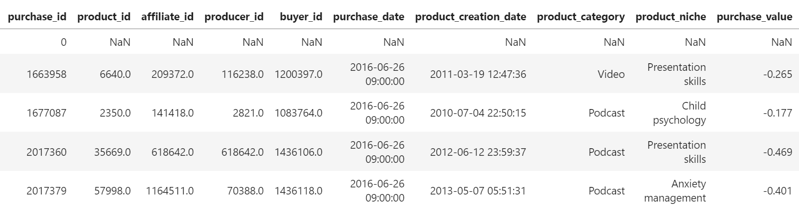{width="755"}

Podemos ver que na primeira linha existem valores NaN, o que é um problema para as análises que serão feitas. Vamos então conferir quantas linhas do dataset existem esse com esse tipo de dados.

    purchase_id                        0
    product_id                         1
    affiliate_id                       1
    producer_id                        1
    buyer_id                           1
    purchase_date                      1
    product_creation_date              1
    product_category                   1
    product_niche                      1
    purchase_value                     1
    affiliate_commission_percentual    1
    purchase_device                    1
    purchase_origin                    1
    is_origin_page_social_network      0

Podemos ver que existe somente uma linha de dados com dados do tipo NaN, que como já vimos, trata-se da primeira linha do dados. Vamos então remove-los.

### Variáveis Contínuas

#### purchase_value

Agora podemos dar uma olhada geral nos dados numéricos. Da tabela abaixo vemos que a variável purchase_value tem valores negativos, o que não faz sentido para um valor de compra. No entanto, pela descrição, sabemos que ela foi codificada em termos de z score, que nada mais é do que o número de desvios padrões em relação a média de um ponto de informação.

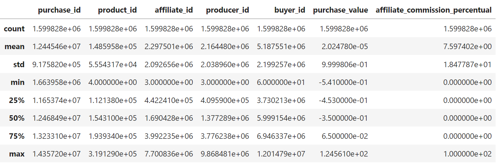

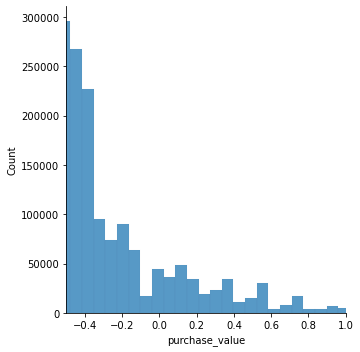

Olhando graficamente existe uma variação entre -0.5 e 1. Podemos utilizar a técnica de normalização MinMaxScaler e assim transformar o intervalo entre 0 e 1 e dessa forma teremos percentualmente o faturamento.

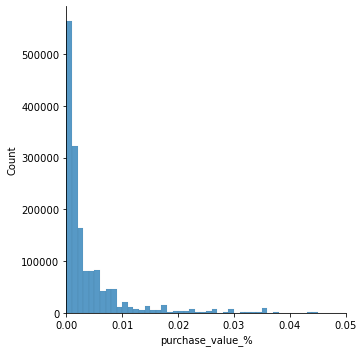

### Variáveis Descretas

Nessa seção, iremos dar uma olhada nas variáveis discretas para procurar por tendências.

#### product_category

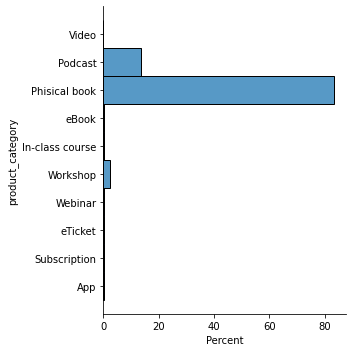

Analisando o gráfico de categoria de produtos, vemos que a maior concentração de vendas na plataforma Hotmart no ano de 2016 foi em livros físicos, representando quase 80% dos casos. Seguidos por Podcast perto dos 20% e Workshop quase todo o resto.

#### product_niche

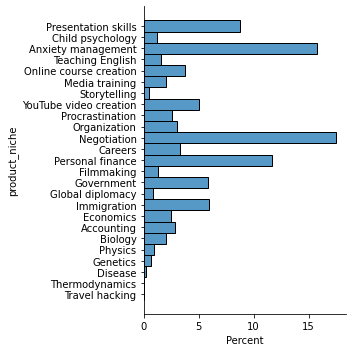

Analisando o gráfico de nichos, vemos que as maiores concentrações de vendas na plataforma Hotmart no ano de 2016 estavam em na categoria de negociação, gerenciamento de ansiedade (autocontrole), que juntos representam quase 30% dos casos. Seguidos por finança pessoal e habilidade de apresentações que somados representam quase 20%.

#### purchase_device

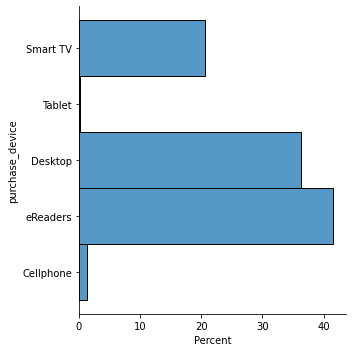

Analisando o gráfico de dispositivos onde são feitas as compras, vemos que a maior concentração de vendas na plataforma Hotmart no ano de 2016 foi em eReaders, representando 40% dos casos. Seguidos por Desktop na casa dos 35% e Smart TV com 20%.

#### is_origin_page_social_network

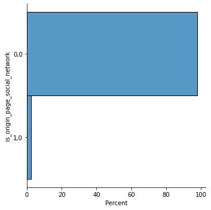

Por último, o gráfico se a compra tem origem de rede sociais, vemos que quase a totalidade está com 0. Sobre esta categoria não ficou claro se 0 representa "Sim" ou "Não"

### Segmentação De Vendas Por Produto

Agora que conhecemos as variáveis discretas e contínuas, vamos analisar as vendas segmentadas por produto.

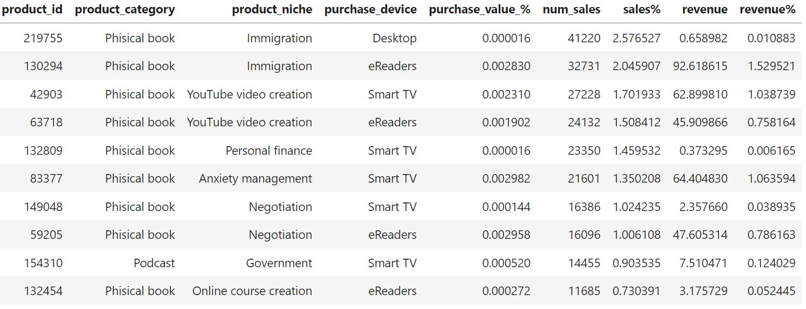

Da tabela gerada, vemos que os produtos mais vendidos foram livros físicos, como era de se esperar, visto que representam quase 80% de vendas na plataforma, focado no nicho de imigração, criação de conteúdo por Youtubers, e finanças. A maioria das compras vieram de eReaders e Smart TV.

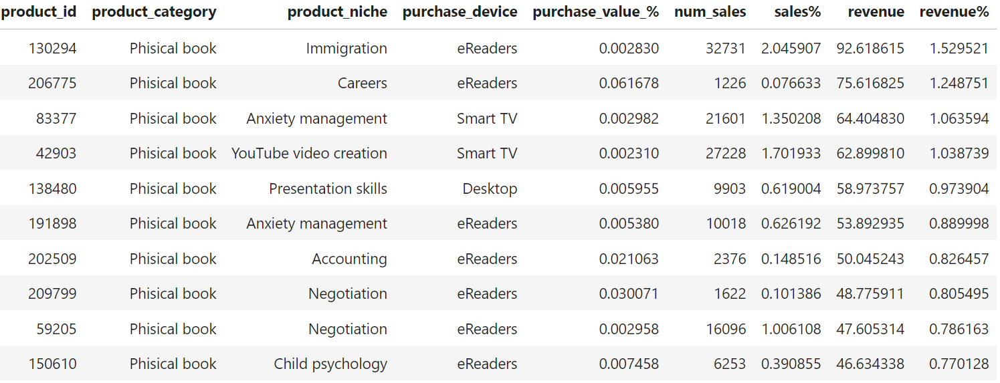

Na tabela acima é possível ver que no quesito de faturamento, o top 10 são todos livros físicos focados no mesmo nicho. O curioso é que as compras foram feitas na maior parte nos eReaders, o que fica o questionamento se a categoria de produtos está realmente correta.

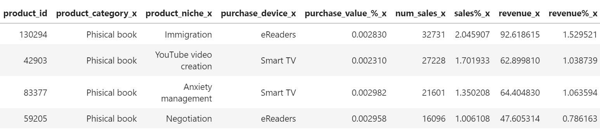

Por último, temos que 4 dos 10 produtos mais vendidos na plataforma também são os produtos que mais geraram receitas.

Agora vamos analisar a relevância de vendas dos produtos na Hotmart.

    top 1 Sales  2.58 %
    top 10 Sales  14.31 %
    top 50 Sales  28.36 %
    top 100 Sales  37.28 %
    top 500 Sales  61.94 %
    top 1000 Sales  73.54 %

    top 1 Revenue  1.53 %
    top 10 Revenue  9.93 %
    top 50 Revenue  27.66 %
    top 100 Revenue  38.51 %
    top 500 Revenue  67.08 %
    top 1000 Revenue  79.07 %

Dos resultados, podemos ver que os 10 produtos que mais deram lucros para a Hormat no ano de 2016 também foram responsáveis por quase 10% de todo o lucro da empresa. Vemos também que 50% dos produtos mais vendidos, são responsáveis por quase 30% de todo o faturamento. No quesito de quantidade de vendas, vemos que o padrão é muito parecido com a quantidade de lucro da empresa.

### Segmentação Das Vendas Por Produtor de Conteúdo

Iremos fazer a mesma análise de seção anterior, mas focado no produtor de conteúdo.

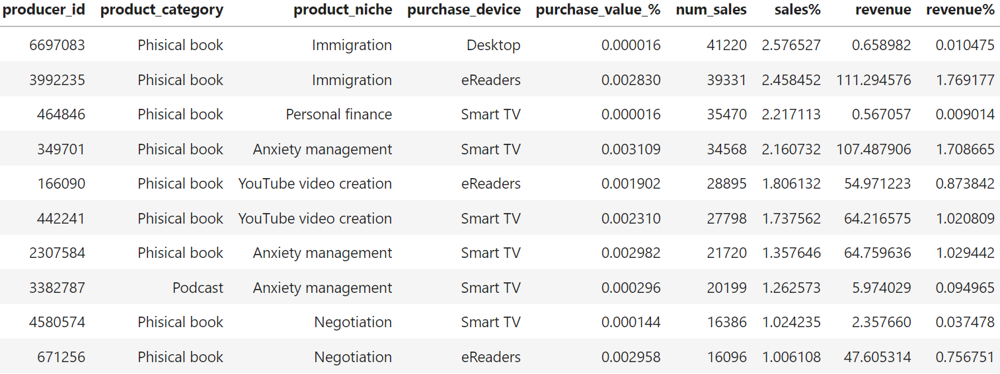

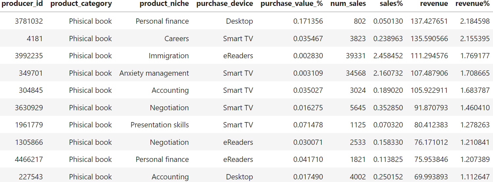

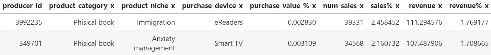

Temos que 2 dos 10 produtores que mais vebdem na plataforma também são os produtos que mais geraram receitas.

Agora vamos analisar a relevância de vendas dos produtores de conteúdo na Hotmart.

    top 1 Sales  2.58 %
    top 10 Sales  17.61 %
    top 50 Sales  36.58 %
    top 100 Sales  48.55 %
    top 500 Sales  79.79 %
    top 1000 Sales  89.94 %

    top 1 Revenue  2.18 %
    top 10 Revenue  15.77 %
    top 50 Revenue  42.69 %
    top 100 Revenue  57.56 %
    top 500 Revenue  87.11 %
    top 1000 Revenue  94.43 %

Dos resultados, podemos ver que os 10 dos produtores de conteúdo que mais deram lucros para a Hormat no ano de 2016 foram responsáveis por quase 15% de todo o lucro da empresa. Vemos também que 100 dos produtores de conteúdo que mais deram lucros, são responsáveis por quase 50% de todo o faturamento daquele ano. No quesito de quantidade de vendas, vemos que o padrão é muito parecido com a quantidade de lucro da empresa.

Podemos concluir que o Hotmart depende dos maiores produtores da plataforma.

## Análise de Séries Temporais

Uma série temporal é uma sequência de pontos de dados obtidos em pontos sucessivos e igualmente espaçados no tempo que podem ser usados para prever o futuro. Um modelo de análise de séries temporais envolve o uso de dados históricos para prever o futuro. Ele procura no conjunto de dados recursos como tendências, flutuações cíclicas, sazonalidade e padrões comportamentais.

### Há épocas do ano em que uma determinada categoria ou nicho de produto vende mais?

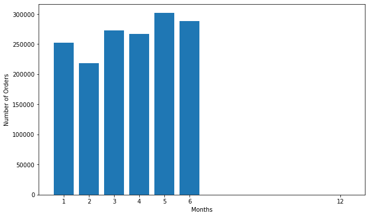

Do gráfico, podemos ver que o mês que tiveram venda na plataforma foi no mês de maio.

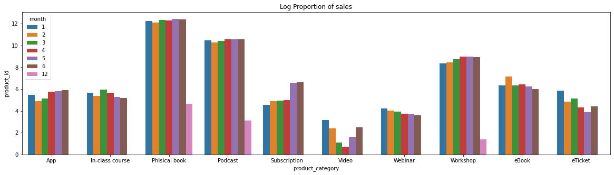

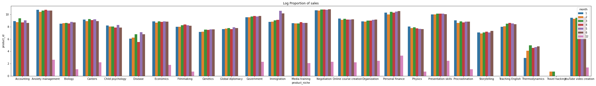{width="1451"}

### A que horas devemos exibir anúncios para maximizar a probabilidade de compra do produto pelo cliente?

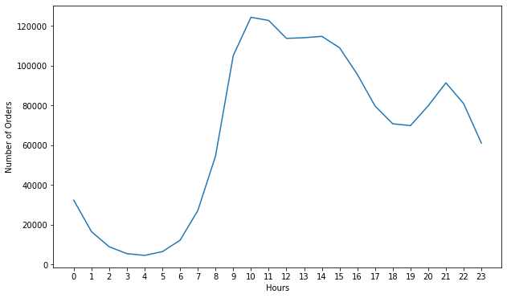

Como você pode ver na Figura, existem aproximadamente 2 picos nos dados. São das 10h às 11h e um menor às 21h . Faz sentido, já que a maioria das pessoas faz compras durante o dia. A partir desses dados, podemos sugerir ao nosso parceiro comercial que anuncie seu produto antes das 12h e/ou 19h. Pode ser 9h30 e/ou 20h30.

### Análise de Predições

As três principais ideias gerais que são fundamentais a serem consideradas para a predições de séries temporais, ao lidar com um problema de previsão de vendas abordado a partir de uma perspectiva de série temporal, são:

-   Padrões de repetição
-   Padrões estáticos
-   Tendências

#### Padrões de Repetição

Vamos começar analisando a série temporal por quantidade de vendas e lucros e procurar se existem padrões de repetição.

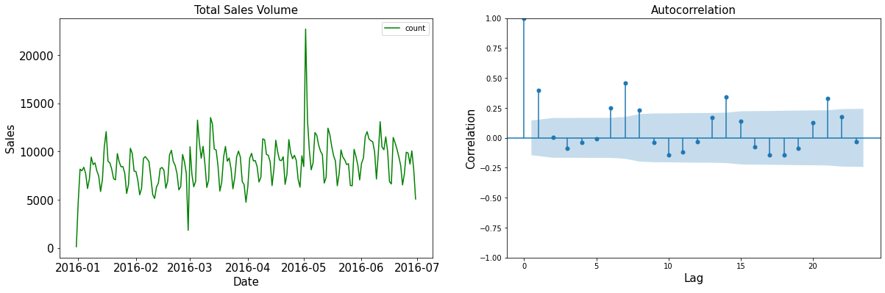

Da tabela e do gráfico podemos ver que o dia que mais teve movimentação foi no dia 2 de maio com quase o dobro das próximas datas do top 10. Olhando somente os dados fornecidos não há muito de especial para explicar esse fato. Olhando o top 10 de maiores transações na plataforma, notamos que outras datas em maio também tiveram grande volume de vendas.

Analisando o gráfico de autocorrelação, vemos alguns pontos de correlação relativamente alta em lag 2 e 7. A falta de uma estrutura bem definida é resultado das contingências de vendas: dado o número de fatos que entram na previsão de vendas, não devemos esperar que os dados tenham correlações perfeitamente claras como em um conjunto de dados meteorológicos, por exemplo. No entanto, é interessante observar picos de correlação que podem estar associados a fatores relacionados ao tipo de produto envolvido.

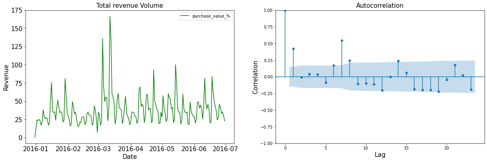

Já em relação ao lucro, podemos ver da tabela e gráfico que os maiores lucros ocorreram no mês de março e junho. Podemos ver também que o gráfico de autocorrelação tem um padrão muito parecido com o de quantidade de vendas.

    Resultados de vendas:
    ADF = -3.0875884164950738
    p-value = 0.02748544055310883
    Resultados de Lucros:
     ADF = -3.6274761082029476
    p-value = 0.005256955239645174

Podemos ver dos testes que o valor p indica uma confiança não significativa de que os dados seriam estacionários

#### Média móvel

Este modelo assume que a próxima observação é a média de todas as observações anteriores e pode ser usado para identificar tendências interessantes nos dados. Podemos definir uma janela para aplicar o modelo de média móvel para suavizar a série temporal e destacar diferentes tendências.

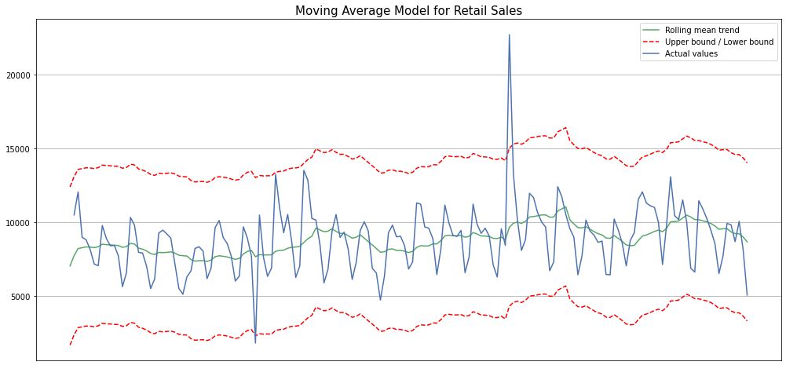

Para o conjunto de dados de vendas, o ajuste não parece tão promissor. Além disso, o parâmetro de janela que define o tamanho de nossa média tem um grande efeito em nosso desempenho geral e não foi feito nenhum ajuste de hiperparâmetro adicional. Aqui, o que devemos levar em consideração é que conjuntos de dados de vendas complexos exigirão mais informações do que uma simples série temporal unidimensional pode fornecer.

#### Arima

ARIMA ou Auto-regressive Integrated Moving Average é um modelo de séries temporais que visa descrever as autocorrelações nos dados de séries temporais. Funciona bem para previsões de curto prazo e pode ser útil para fornecer valores previstos para períodos especificados pelo usuário, mostrando bons resultados para demanda, vendas, planejamento e produção.

Os parâmetros do modelo ARIMA são definidos da seguinte forma:

-   p: O número de observações de atraso incluídas no modelo
-   d: O número de vezes que as observações brutas são diferenciadas
-   q: O tamanho da janela de média móvel

```{=html}
<!-- -->
```
    MSE error: 7473419.795985948

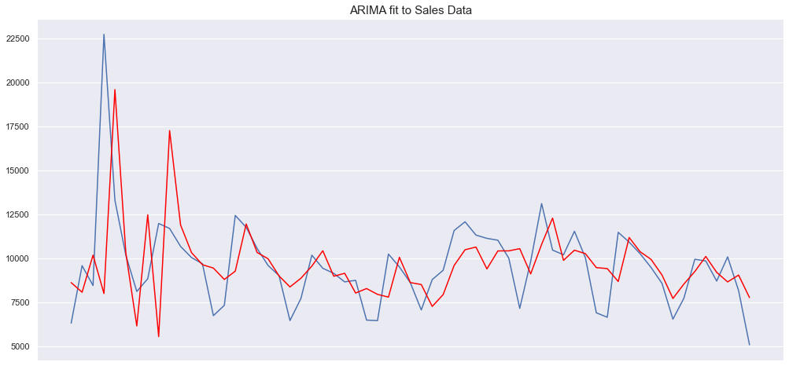

Podemos ver que tivemos um resultado muito ruim com o MSE bem alto. Vamos apenas lembrar que os resultados aqui são apenas para mostrar os modelos e não representam uma estimativa precisa. Os conjuntos de dados são limitados (o conjunto de dados de vendas após a soma é menor que 200 pontos de dados) e não foi realizado nenhum ajuste de hiperparâmetro complexo. O objetivo aqui foi apenas demonstrar como esses modelos funcionam e como eles podem ser implementados. Podemos verificar que o conjunto de dados de vendas parece apresentar desafios que os modelos tradicionais não conseguem superar.

Podemos ver que, para conjuntos de dados que possuem um padrão claro, os modelos tradicionais funcionam bem. No entanto, na ausência de tal estrutura, esses modelos não parecem apresentar flexibilidade para se adaptar, pois dependem de fortes suposições sobre a dinâmica da série temporal alvo.
