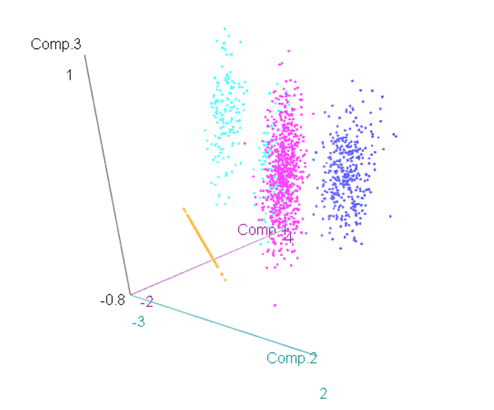

# Telecom Análise de Clusters

## Análise Exploratória dos Dados

A clusterização pode ser usada para agrupar clientes com base em semelhanças. A segmentação de clientes pode ser usada para criar estratégia de marketing apropriada para o segmento. Nesta atividade iremos analisar a clusterização k-means utilizando o dataset de uma operadora de Telecom. O dataset é composto por 1500 clientes e iremos analisar as variáveis de tempo médio usado em chamadas de longa distância, local e internacional para fazer a clusterização.

```{r include=FALSE}
library(cluster)
library(factoextra)
library(dendextend)
library(car)
library(hopkins)
```

```{r include=FALSE}
# Carregando os dados
exemplo7 <- read.table("dataset/exemplo7.csv", header=TRUE, sep=";", na.strings="NA", dec=",", strip.white=TRUE)
```

Vamos iniciar explorando os dados:

```{r echo=FALSE}
#Análise dos Dados
scatterplotMatrix(exemplo7[1:3], regLine=FALSE, smooth=FALSE, ellipse=list(levels=c(.5, .9)),id=list(method="mahal", n=5),diagonal=list(method="boxplot"))

summary(exemplo7[1:3])
```

Dos dados, vemos que as 3 variáveis apresem outliers sendo que a variável local é a que mais tem outliers. Além disso, o valor mínimo de longdist e internat é 0, o que faz sentido já que estamos analisando o tempo médio e variação dos dados é grande. Vamos padronizar e olhar os histograma das variáveis

```{r echo=FALSE}
exemplo7$Zlongdist<- scale(exemplo7$longdist)
exemplo7$Zinternat<- scale(exemplo7$internat)
exemplo7$Zlocal<- scale(exemplo7$local)
summary(exemplo7[,c("Zlongdist", "Zinternat", "Zlocal")])
```

```{r include=FALSE}
hist(exemplo7[,"Zlongdist"])
hist(exemplo7[,"Zinternat"])
hist(exemplo7[,"Zlocal"])
```


Do histograma podemos ver que a variável longist é que mais se aproxima de uma distribuição normal, já a variável internat temos uma distribuição skew à esquerda.

### Estatística de Hopkins

Uma primeira análise que podemos começar é avaliar se existe estrutura nos dados para a formação de clusters, pois sabemos que sempre existirá formação de clusters nos dados. Para fazer essa análise podemos utilizar a estatística de Hopkins (H) que tenta analisar se de fato existe uma estrutura de clusters nos dados.

O que o algoritmo faz é gerar pontos aleatórios fora da amostra e selecionar pontos dentro da amostra e calcular a distância entre os pontos que foram pegos na amostra até o ponto mais próximo. Se o valor $\mathbf{H}$ for maior que 0.75, então existe uma tendência de clusterizações nos dados com 90% de confiança.

```{r echo=TRUE}
# Análise Preliminar dos Dados
hopkins(exemplo7[1:3], m=nrow(exemplo7)*0.15)
```

Do resultado nos nossos dados, obtemos um valor $\mathbf{H} = 0.99$, o que mostra que o nosso dataset tem sim dados clusterizados.

### Heatmap

Vamos ver o heatmap do dendrograma do dataset. Um dendrograma é um diagrama de árvores que agrupa as entidades que estão mais próximas umas das outras.

```{r eval=FALSE, include=FALSE}
heatmap(as.matrix(exemplo7[1:3]), scale="col", col=heat.colors(10, rev = FALSE)
```


Conforme mostrado acima, o dendrograma reordena as observações com base na proximidade entre os dados usando alguma métrica de distância (neste caso a euclidiana). A árvore à esquerda do dendrograma representa a distância relativa entre nós. Podemos ver do dendrograma internat se juntando com longdist para depois se juntarem com local. No gráfico hierárquico na esquerda não está muito claro quantos grupos podemos ter, mas aparentemente desta análise inicial parece convergir para 3 grupos.

Vamos agora dar uma olhada na Matriz de Dissimilaridade

```{r eval=FALSE, include=FALSE}
hcex5c <- hclust(dist(exemplo7[1:3]), method="complete")
ord <- order(cutree(hcex5c, k = 9))
dij <- dist(exemplo7[1:3])
image(as.matrix(dij)[ord, ord], col=heat.colors(10, rev = FALSE), main = "Matriz de Dissimilaridades")
```


Da Matriz de Dissimilaridade é possível ver um grande grupo seguidos de um grupo médio e de 2 grupos menores.

### Visualização 3d

```{r eval=FALSE, include=FALSE}
scatter3d(local ~ longdist + internat, data = exemplo7, point.col="blue", surface=FALSE)
```


Da visualização 3d podemos ver novamente 3 grupos assim como quando fizemos a análise do heatmap e um quarto grupo no eixo da variável local. Sabemos dos gráficos de boxplot que esses dados são possivelmente outlier, além disso, do gráfico de dissimilaridade vimos um pequeno grupo no quanto superior direito do gráfico que pode ser explicado por esses dados.

### Análise de Multicolinearidade

Vamos ver agora como esta a multicolinearidade

```{r echo=FALSE}
vif(lm(age ~Zlongdist+Zinternat+Zlocal, data=exemplo7))
```

Do resultado, podemos ver que as variáveis não são redundantes, tendo assim uma colinearidade baixa. Podemos então utilizar as 3 variáveis com segurança para fazer os clusters.

## Análise de Clusters

Feito uma exploração inicial nos dados podemos agora de fato trabalhar na análise de Clusters.

**Definição da Medida de Similaridade:** Como as variáveis tem métricas em escalas diferentes, será utilizado a distância euclidiana com padronização.

**Pressupostos:**

1.  A amostra é considerada como representativa dos grupos de clientes da empresa
2.  Não existe problema de colinearidade

Para a análise de clusters será utilizado uma combinações entre os métodos hierárquicos e não-hierárquicos. O método hierárquico será utilizado para especificar os centroides e o não-hierárquico (k-means) será utilizado para realizar a clusterizaçao.

Vamos começar a análise dos clusters comparando 3 alternativas (Ward, Average, Centroids) pois são menos sensíveis a outliers.

```{r include=FALSE}
#Primeira Fase - Hierárquica
hc5_ward <- hclust(dist(exemplo7[,c("Zlongdist", "Zinternat", "Zlocal")]), method="ward.D2")
hc5_average <- hclust(dist(exemplo7[,c("Zlongdist", "Zinternat", "Zlocal")]), method="average")
hc5_centroid <- hclust(dist(exemplo7[,c("Zlongdist", "Zinternat", "Zlocal")]), method="centroid")

dend_w <- as.dendrogram(hc5_ward)
dend_a <- as.dendrogram(hc5_average)
dend_c <- as.dendrogram(hc5_centroid)
plot(dend_w, main= "Dendrograma para a solucao Ward", xlab= "Numero da observacao em Exemplo7", sub="Method=Ward")
plot(dend_a, main= "Dendrograma para a solucao Average", xlab= "Numero da observacao em Exemplo7", sub="Method=Average")
plot(dend_c, main= "Dendrograma para a solucao Centroids", xlab= "Numero da observacao em Exemplo7", sub="Method=Centroids")
```


Dos dendrogramas gerados, o Ward aparenta ter o melhor comportamentos para os nossos dados apresentando clusters bem definidos. O método Average e Centroids acabaram gerando muita confusão na clusterização.

### Definição da Quantidade de Clusters

Próxima etapa é olhar a quantidade ideal de clusters utilizando o método do cotovelo.

```{r echo=FALSE}
fviz_nbclust(exemplo7[,c("Zlongdist", "Zinternat", "Zlocal")], FUN = hcut, method = "wss", hc_method="ward.D2")
```

Do gráfico acima acima, vemos que o ideal número de clusters está entre 2 e 4, que é exatamente o número de clusters que as análises inicias indicavam. Vamos então analisar com essa quantidade de clusters.

```{r include=FALSE}
plot(hc5_ward)
rect.hclust(hc5_ward, k=2)
plot(hc5_ward)
rect.hclust(hc5_ward, k=3)
plot(hc5_ward)
rect.hclust(hc5_ward, k=4)
```


As 3 soluções parecem ser boas para utilizar na clusterizações de clientes. Por isso vamos fazer o perfil e interpretação para todas elas.

### Perfil e Interpretação da Solução de 2 clusters

```{r include=FALSE}
by(exemplo7[,c("Zlongdist", "Zinternat", "Zlocal")], as.factor(cutree(hc5_ward, k = 2)), colMeans)
biplot(princomp(exemplo7[,c("Zlongdist", "Zinternat", "Zlocal")]), xlabs = as.character(cutree(hc5_ward, k = 2)))
exemplo7$hcw_2 <- cutree(hc5_ward, k = 2)
Boxplot(exemplo7[exemplo7$hcw_2==1, c("Zlongdist", "Zinternat", "Zlocal")], main="Cluster1")
Boxplot(exemplo7[exemplo7$hcw_2==2, c("Zlongdist", "Zinternat", "Zlocal")], main="Cluster2")
```


Analisando os grupos pelo bloxplot, vemos que no cluster1 a mediana das 3 variáveis são bem próximas e está entre 1 e 2. No cluster2 a mediana entre longdist e local continuam parecidas com mediana centrado em 0, já a internat fica menor.

```{r echo=FALSE}
summary(aov(Zlongdist ~hcw_2, data=exemplo7))
summary(aov(Zinternat ~hcw_2, data=exemplo7))
summary(aov(Zlocal ~hcw_2, data=exemplo7))
```

Todos os grupos tem uma diferença estatística.

```{r echo=FALSE}
clusplot(exemplo7[,c("Zlongdist", "Zinternat", "Zlocal")], cutree(hc5_ward, k=2))
```

Quando dividimos em dois grupos vemos que são dois grupos distintos sem que exista mistura entre eles. No grupo da esquerda observamos uma agrupamentos de dados do lado esquerdo. Iremos ver mais adiante o que acontece quando aumentarmos o número de clusters.

```{r eval=FALSE, include=FALSE}
pc <- princomp(exemplo7[,c("Zlongdist", "Zinternat", "Zlocal")])
scatter3d(Comp.3 ~ Comp.1 + Comp.2, groups = as.factor(exemplo7$hcw_2), data = pc$scores, surface=FALSE)
```


Da análise das componentes principais, utilizando 2 grupos podemos ver o grupo rosa parece ser segmentando em 3 grupos, indicando que talvez uma solução com 4 clusters seja mais indicado.

### Perfil e Interpretação da Solução de 3 clusters

```{r include=FALSE}
by(exemplo7[,c("Zlongdist", "Zinternat", "Zlocal")], as.factor(cutree(hc5_ward, k = 3)), colMeans)
biplot(princomp(exemplo7[,c("Zlongdist", "Zinternat", "Zlocal")]), xlabs = as.character(cutree(hc5_ward, k = 3)))
exemplo7$hcw_3 <- cutree(hc5_ward, k = 3)
Boxplot(exemplo7[exemplo7$hcw_3==1, c("Zlongdist", "Zinternat", "Zlocal")], main="Cluster1")
Boxplot(exemplo7[exemplo7$hcw_3==2, c("Zlongdist", "Zinternat", "Zlocal")], main="Cluster2")
Boxplot(exemplo7[exemplo7$hcw_3==3, c("Zlongdist", "Zinternat", "Zlocal")], main="Cluster3")
```


Analisando os grupos pelo bloxplot, vemos que no cluster1 a mediana das 3 variáveis são bem próximas e está entre 1 e 2. No cluster2 a mediana entre chamadas de longa distância e local continuam parecidas com mediana centrado em 0, já a chamada internacional fica menor igual vimos na análise com 2 clusters. Para o clusters 3, somente chamadas locais tem valores, o que era esperado pelo que comentamos no início e podemos existir grupo de pessoas que somente fazem chamadas locais.

```{r echo=FALSE}
clusplot(exemplo7[,c("Zlongdist", "Zinternat", "Zlocal")], cutree(hc5_ward, k=3))
```

```{r eval=FALSE, include=FALSE}
pc <- princomp(exemplo7[,c("Zlongdist", "Zinternat", "Zlocal")])
scatter3d(Comp.3 ~ Comp.1 + Comp.2, groups = as.factor(exemplo7$hcw_3), data = pc$scores, surface=FALSE)
```


### Perfil e Interpretação da Solução de 4 clusters

```{r include=FALSE}
by(exemplo7[,c("Zlongdist", "Zinternat", "Zlocal")], as.factor(cutree(hc5_ward, k = 4)), colMeans)
biplot(princomp(exemplo7[,c("Zlongdist", "Zinternat", "Zlocal")]), xlabs = as.character(cutree(hc5_ward, k = 4)))
exemplo7$hcw_4 <- cutree(hc5_ward, k = 4)
Boxplot(exemplo7[exemplo7$hcw_4==1, c("Zlongdist", "Zinternat", "Zlocal")], main="Cluster1")
Boxplot(exemplo7[exemplo7$hcw_4==2, c("Zlongdist", "Zinternat", "Zlocal")], main="Cluster2")
Boxplot(exemplo7[exemplo7$hcw_4==3, c("Zlongdist", "Zinternat", "Zlocal")], main="Cluster3")
Boxplot(exemplo7[exemplo7$hcw_4==4, c("Zlongdist", "Zinternat", "Zlocal")], main="Cluster4")

```


Na análise com 4 clusters vemos uma padrão bem parecido com o que ja vimos com 3 clusters no cluster 4 (lá era cluster 3) e cluster 1. Para o cluster 2 e cluster 3 temos uma mudança com a separação do grande grupo que tínhamos antes. Agora é possível ver que o grupo 2 prioriza mais chamadas locais e de longa distância, já o grupo 4 prefere chamadas internacionais.

```{r echo=FALSE}
clusplot(exemplo7[,c("Zlongdist", "Zinternat", "Zlocal")], cutree(hc5_ward, k=4))
```

No clusplot podemos ver que um grupo superpos outro quando aumentando para 4 clusters. Vamos dar uma olhada nas componentes principais.

```{r eval=FALSE, include=FALSE}
pc <- princomp(exemplo7[,c("Zlongdist", "Zinternat", "Zlocal")])
scatter3d(Comp.3 ~ Comp.1 + Comp.2, groups = as.factor(exemplo7$hcw_4), data = pc$scores, surface=FALSE)
```



Da solução com 4 clusters, graficamente quando olhamos as componentes principais vemos uma mistura no maior grupo, acontecendo uma superposição entre o clusters azul claro e rosa. Vamos analisar se utilizando os clusters não-hierárquicos nós não conseguimos fazer uma separação melhor.

## Clusters não-Hierárquicos

Agora que temos um análise mais clara dos clusters, iremos utilizar a solução para 3 ou 4 clusters para a clusterização não-hierárquica.

Vamos iniciar criando os centroides para as duas soluções

```{r echo=FALSE}
centroides_3<- aggregate(cbind(Zlongdist, Zinternat, Zlocal) ~ hcw_3,   data=exemplo7, FUN=mean)
centroides_4<- aggregate(cbind(Zlongdist, Zinternat, Zlocal) ~ hcw_4,   data=exemplo7, FUN=mean)

centroides_3
centroides_4
```

```{r echo=FALSE}
km7_3 <- kmeans(exemplo7[,c("Zlongdist", "Zinternat", "Zlocal")], centers = centroides_3[2:4], nstart=1, iter.max=100)
exemplo7$km7_3 <- as.factor(km7_3$cluster)
clusplot(exemplo7[,c("Zlongdist", "Zinternat", "Zlocal")], km7_3$cluster, lines=0)
```

Do resultados, obtivemos 2 clusters que têm centroids que fazem intersecçao entre os grupos o que não parece ser melhor que os grupos formados somente pela clusterização hierárquica.

```{r eval=FALSE, include=FALSE}
pc <- princomp(exemplo7[,c("Zlongdist", "Zinternat", "Zlocal")])
scatter3d(Comp.3 ~ Comp.1 + Comp.2, groups = as.factor(km7_3$cluster), data = pc$scores, ellipsoid=TRUE, surface=FALSE)
```


Vamos ver agora a formação para 4 clusters.

```{r echo=FALSE}
km7_4 <- kmeans(exemplo7[,c("Zlongdist", "Zinternat", "Zlocal")], centers = centroides_4[2:4], nstart=1, iter.max=100)
exemplo7$km7_4 <- as.factor(km7_4$cluster)
clusplot(exemplo7[,c("Zlongdist", "Zinternat", "Zlocal")], km7_4$cluster, lines=0)
```

Para 4 clusters temos uma solução muito mais homogenia, com uma melhor separação entre os clusters meio.

```{r eval=FALSE, include=FALSE}
pc <- princomp(exemplo7[,c("Zlongdist", "Zinternat", "Zlocal")])
scatter3d(Comp.3 ~ Comp.1 + Comp.2, groups = as.factor(km7_4$cluster), data = pc$scores, ellipsoid=TRUE, surface=FALSE)
```


Quando olhamos o gráfico em 3d com as componentes principais podemos ver uma separação muito melhor do que ocorreu com o caso de clusterização hierárquica.

## Interpretação e Validação do Modelo

```{r echo=FALSE}
by(model.matrix(~-1 + Zlongdist + Zinternat + Zlocal, exemplo7),exemplo7$km7_3, colMeans)
```

```{r echo=FALSE}
by(model.matrix(~-1 + Zlongdist + Zinternat + Zlocal, exemplo7),exemplo7$km7_4, colMeans)
```

### Idade

Vamos analisar o perfil demográfico começando pela idade.


Com 3 grupos temos um perfil bem semelhantes entre os grupos. A mediana de todos eles estão entre 40 e 50 anos. Quando analisamos 4 grupos a mediana também apresenta uma idade entre 40 e 50 anos. Com uma mediana menor para o grupo 4 que só fazem ligações locais.

### Sexo

Vamos agora olhar o perfil por sexo.


Para sexo tanto a solução para 3 quanto para 4 clusters apresentam um uso maior por mulheres.

### Estado Civil

```{r eval=FALSE, include=FALSE}
# Estado Civil
barplot(table(exemplo7$marital,exemplo7$km7_3), legend.text=TRUE, beside=TRUE, main="Cluster", args.legend=list(x="top", horiz=TRUE, title="Estado Civil"))
barplot(table(exemplo7$marital,exemplo7$km7_4), legend.text=TRUE, beside=TRUE, main="Cluster", args.legend=list(x="top", horiz=TRUE, title="Estado Civil"))
```


Para o caso do Estado Civil vemos que pessoas casadas são as que mais usam o serviços em todos os grupos em mandas as soluções.

### Tipo de Plano


Para o tipo de plano, notamos que o clister formado por pessoas que somente fazem ligações locais não apresentam nenhum tipo de plano. O time de marketing pode investir neste cluster para fazer-los mudar de plano.

### Churn


Por último temos a variável status que mostra o churn dos clientes, o time de marketing conhecendo melhor o que cada grupo significa podem fazer estratégias baseadas na clusterização para tentar reter os clientes.

## Conclusão

Da análise feita nos dados e nos métodos de Clusters hierárquico e não-hierárquico, chegamos na resposta que o número ideal de clusters para ser usado na empresa está entre 3 e 4. Além disso, dos métodos apresentados, utilizar o método Ward de clusterização hierárquica para descobrir os centroides e depois aplicar o método não-hierárquico k-means aparentou ser um método muito poderoso para clusterização.
