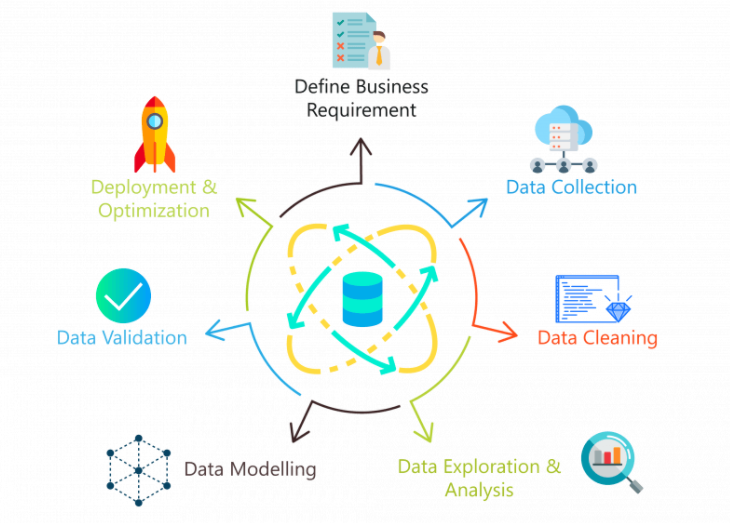

# Preface {.unnumbered}

In this portfolio, you will find case studies covering the area of ​​Data Science.

{width="556"}

# Introduction {.unnumbered}

The demand for skilled data science practitioners in industry, academia, and government is rapidly growing. This portfolio introduces concepts and skills that can help it tackle real-world data analysis challenges. It covers concepts from probability, statistical inference, linear regression, and machine learning.

## Case studies {.unnumbered}

Throughout the portfolio, we use motivating case studies. In each case study, we try to realistically mimic a data scientist's experience. For each of the concepts covered, we start by asking specific questions and answer these through data analysis. We learn the concepts as a means to answer the questions. Case studies included in the portfolio are:

| **Case Study**                         | **Concept**                                 |
|----------------------------------------|---------------------------------------------|
| GDP And Energy Supply                  | Data Cleaning and Data Visualization        |
| Medical Insurance Costs                | Data Visualization and Linear Regression    |
| Quantium Retail Strategy And Analytics | Statistical Inference                       |
| Ok Cupid                               | Descriptive statistics and Machine Learning |
| Real Estate São Paulo Rent Prediction  | Complete Data Science Problem               |

All codes and projects in this portfolio can be found on my Github page: [GitHub](https://github.com/WMaia9)

# About Me {#author .unnumbered}

I'm a data scientist and currently work at the Hand Talk company, which applies artificial intelligence for accessibility. I graduated in Science Physics and at this moment I'm studying an MBA course in Data Science and Analytics.

I'm passionate about technology and science. At all times I am always looking to learn new things.

During graduation I participated in Scientific Initiation projects. The first one, Improvement of collimation systems for gamma-particle coincidence measurements, consisted of calculating Rutherford collisions by means of programming in C language and whose objective was to understand the operation of the collimator of the accelerator Pelletron from University of São Paulo. In the second one, the focus was on the High Energy Physics area at LHC at CERN with case studies.

I worked for a while in the financial market, interning at the trading desk. After that, I dedicated myself for a few years to teaching Physics.

On this page you will find some of the projects that I am currently working on. You can see my Linkedin [Here](https://www.linkedin.com/in/wesley-maia-62009612a/).\

{width="336"}
